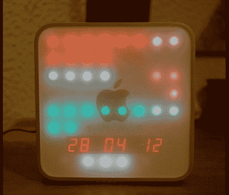

# LED 时钟照亮了一个死了的苹果迷你

> 原文：<https://hackaday.com/2012/04/30/led-clock-lights-up-a-dead-mac-mini/>

【沙多科教授的】Mac Mini 死了。但是由于苹果产品上的外壳设计是购买它们的一半原因，[他决定通过把它变成这个钟](http://www.bricobidules.com/index.php?post/2012/04/29/iTime%2C-une-horloge-sous-Arduino-dans-un-bo%C3%AEtier-de-Mac-Mini) ( [翻译](http://translate.google.com/translate?sl=auto&tl=en&js=n&prev=_t&hl=en&ie=UTF-8&layout=2&eotf=1&u=http%3A%2F%2Fwww.bricobidules.com%2Findex.php%3Fpost%2F2012%2F04%2F29%2FiTime%252C-une-horloge-sous-Arduino-dans-un-bo%25C3%25AEtier-de-Mac-Mini))来重复利用外壳。

正如我们昨天看到的二进制时钟一样，这个时钟使用一束 led 来显示时间，但如果你知道你在寻找什么，它的显示方式更容易阅读。该面已被分成两列。左边是小时，然后是以 5 为增量的分钟和秒钟。右边是 AM/PM，分和秒的增量为 1。如果我们做对了，上面看到的时间是 2012 年 4 月 28 日晚上 10:23:42。日期下方的白色发光二极管就像一个数字钟摆，随着时间的流逝而左右滚动。

该显示器使用两个 MAX7219 LED 驱动器来控制建立在一大块原型板上的网格。Arduino 通过 Chonodot 将整个系统联系在一起，以实现精确计时。甚至还有一个环境光传感器，它可以调整 LED 的强度，使其在阳光直射或黑夜中可读。休息后，观看嵌入的演示剪辑。

[https://www.youtube.com/embed/mr4zjBw0lzQ?version=3&rel=1&showsearch=0&showinfo=1&iv_load_policy=1&fs=1&hl=en-US&autohide=2&wmode=transparent](https://www.youtube.com/embed/mr4zjBw0lzQ?version=3&rel=1&showsearch=0&showinfo=1&iv_load_policy=1&fs=1&hl=en-US&autohide=2&wmode=transparent)