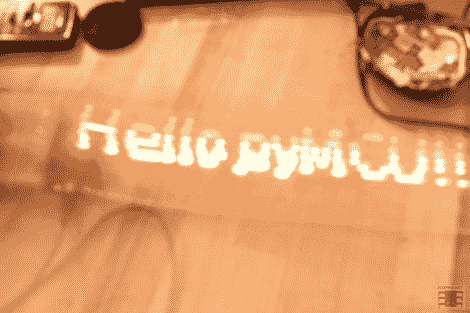

# 使用 PyMCU 进行 LED 趣味和灯光绘画

> 原文：<https://hackaday.com/2012/11/05/led-fun-and-light-painting-with-the-pymcu/>

最近[【py MCU】](http://www.pymcu.com/ "pyMCU")的【Richard】好心地送了我一个他们的单位去试用。正如[在](http://hackaday.com/2012/02/28/python-pic-useful-when-attached-to-a-computer/ "pyMCU on HAD")之前在这里介绍的，这个小板子允许你使用你的计算机和 Python 编程语言来控制物理事物。在对它进行评估和[让 LED 闪烁](http://www.jcopro.net/2012/09/13/first-impressions-of-the-pymcu-python-microcontroller/ "evaluation and LED blinking of the pyMCU")之后，我还想尝试几个其他的 LED 项目。

第一个想法是[制作一个 LED 追踪器](http://www.jcopro.net/2012/10/11/chasing-leds-with-the-pymcu/ "chasing LEDs with pyMCU")。这非常简单，只需使用一点代码并插入几个 led。由此，既然你可以让发光二极管互相追逐，那么在正确的顺序下，它应该可以用来显示长时间曝光摄影的图像。请务必在这 10 个 LED 追踪器/灯条组装完成后观看视频。

这个 [LED 灯条实验](http://www.jcopro.net/2012/10/16/writing-text-in-leds-with-the-pymcu/ "simple LED light bar pyMCU")的结果真的很酷，用 10 个 LED 写了一些简单的文字和图像。考虑到组件数量少，这是我们见过的最简单的灯条构建之一。编程也很简单，因为使用 Python 的计算机完成了绘图的所有处理以及物理地打开和关闭 led。当然，这种设置也有其局限性，最明显的是必须连接到计算机上。

[https://www.youtube.com/embed/zwDdLGW580c?version=3&rel=1&showsearch=0&showinfo=1&iv_load_policy=1&fs=1&hl=en-US&autohide=2&wmode=transparent](https://www.youtube.com/embed/zwDdLGW580c?version=3&rel=1&showsearch=0&showinfo=1&iv_load_policy=1&fs=1&hl=en-US&autohide=2&wmode=transparent)