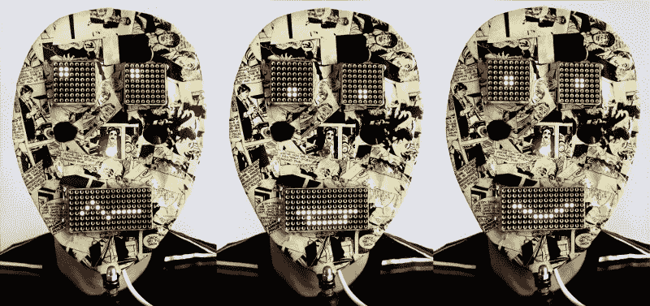

# LED 矩阵面具将吓得节日欢呼

> 原文：<https://hackaday.com/2013/12/24/led-matrix-mask-will-scare-up-holiday-cheer/>

【大卫 】发给我们[这个有趣的 LED 矩阵面具](http://davidegironi.blogspot.it/2013/12/a-matrix-led-mask-built-on-avr-atmega8.html)他用 ATMega8 和 [74LS595N](http://www.ti.com/lit/ds/sdls006/sdls006.pdf) 移位寄存器做的。每只眼睛是一个 8×8 的 LED 矩阵，嘴巴由两个 8x8 组成。[Davide]使用了一个 [ULN2803A](https://www.sparkfun.com/datasheets/IC/uln2803a.pdf) 达林顿晶体管阵列来驱动矩阵。

当用户走到面具后面时，红外传感器会检测到一张脸在范围内，并激活面部特征。代码随机运行眼睛和嘴巴模式。如果用户开始说话，麦克风元件检测他的声音，并执行单独的说话嘴型。

面具本体和支架[与](http://en.wikipedia.org/wiki/Decoupage)和[迪伦狗](http://en.wikipedia.org/wiki/Dylan_Dog)漫画中的页面分离。[Davide]说他几年前就做好了这个面具，但决定将它提交给在米兰举行的 2013 年 Inverart 艺术博览会。正如你可能想象的那样，到目前为止，这种面具在孩子们当中大受欢迎。跳伞后，留下来看大卫的圣诞表演。[大卫]没有给我们任何关于那顶可爱的帽子的细节，很遗憾。

如果你需要更好的保护或更多的 LED，看看这个 [LED 头盔](http://hackaday.com/2013/09/06/homemade-led-helmet/)。

[https://www.youtube.com/embed/vYDI6PBTi10?version=3&rel=1&showsearch=0&showinfo=1&iv_load_policy=1&fs=1&hl=en-US&autohide=2&wmode=transparent](https://www.youtube.com/embed/vYDI6PBTi10?version=3&rel=1&showsearch=0&showinfo=1&iv_load_policy=1&fs=1&hl=en-US&autohide=2&wmode=transparent)