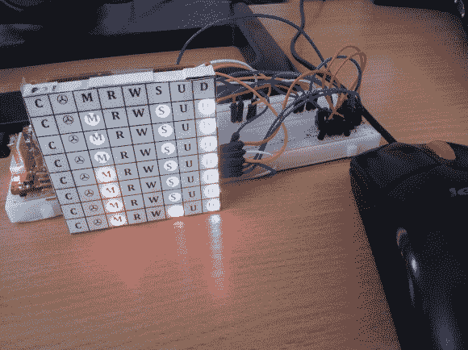

# 用于显示您电脑的负载、流量和状态数据的 LED 模块

> 原文：<https://hackaday.com/2013/07/20/led-module-used-to-display-load-traffic-and-status-data-for-your-pc/>

你会喜欢【Ivan 的】关于[这款 LED 电脑状态监视器](http://www.ivancreations.com/2013/07/real-computer-monitoring-block.html)的报道。当然，他不只是展示和讲述最终产品——如果他有，你会在一个链接帖子中读到这篇文章。但是他也没有详细说明他是如何把这些东西组合在一起的。不，他分享了让他来到这里的每一次迭代的照片和细节。

它从一个转速计开始。是的，你放在汽车仪表板上的模拟显示器可以显示每分钟转数。他想把它做成一个能读出他的 CPU 负载的 USB 设备。但是，当它一次只能显示一个东西时，工作量就非常大了。因此，他决定添加一个 8×8 LED 模块，用于显示 CPU 中每个内核的负载。在发光转速表旁边看起来很棒。在那里，他通过转换到 RGB 模块来增加分辨率，最终将他吸引到一个编码项目中，以扩展推送到他的嵌入式硬件的数据。最后，他的建议(真正的计算机监控块)显示 CPU 负载，内存使用，硬盘活动的几个方面，以及网络上行和下行流量。

我们认为他可能从这个小小的展示中榨取了所有他能榨取的东西。升级到 TFT LCD 的时间。

[https://www.youtube.com/embed/zz_DhJyozUs?version=3&rel=1&showsearch=0&showinfo=1&iv_load_policy=1&fs=1&hl=en-US&autohide=2&wmode=transparent](https://www.youtube.com/embed/zz_DhJyozUs?version=3&rel=1&showsearch=0&showinfo=1&iv_load_policy=1&fs=1&hl=en-US&autohide=2&wmode=transparent)