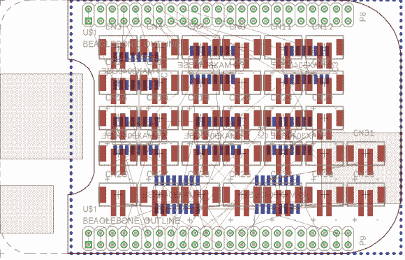

# 发光二极管带岬驱动公里价值的发光二极管

> 原文：<https://hackaday.com/2013/08/04/led-strip-cape-drives-kilometers-worth-of-leds/>

[Hudson]希望开发大量的 led。一个能有效处理数公里长的 LED 灯条的驱动器并不容易得到。所以他正在设计自己的猎兔犬斗篷来完成这项工作。上面你可以看到他正在做的棋盘布局。注意到中间一组重复的红色脚印了吗？这些是用于 32 个 RS485 连接器的衬垫！

当然，这都是在为《燃烧的人》做准备，那里的咒语似乎是:谁有最多的 led 就赢了。嗯，除非你是那种喜欢用火焰工作的人。但是我们跑题了。[Hudson]正在处理的缩放问题围绕着他的愿望，即不包括荒谬的数字微控制器，以及需要增强 BeagleBone 的 3.3V 逻辑电平，以在条带的数据总线上传输更远。通过利用 RS485 协议(旨在长距离传输数据)，他可以通过在每个远程条形连接器上添加 RS485 转换器来摆脱单个处理单元。他计划使用 BeagleBone 的可编程实时单元功能来处理 cape 上的八个驱动程序。但首先他必须解决一个看起来很棘手的追踪路由问题