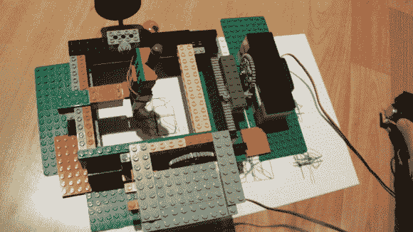

# 乐高绘图机绘制积木形状最好

> 原文：<https://hackaday.com/2014/07/13/lego-drawing-machine-draws-block-shapes-best/>

热爱画画但又非常害怕钢笔墨水的[Marcel]想出了一个用乐高制成的小画图机来帮他完成这个任务。这不是一个非常复杂的构建，但它确实有几个不同的组件来完成一项任务，这本身就很酷。哦，对了，只是开个“害怕钢笔墨水”的玩笑。

RC 汽车伺服系统用于在 X 和 Y 方向驱动笔。这些伺服系统只有 180 度的运动范围，不足以将笔移动很远。为了增加笔的移动距离，[Marcel]在伺服系统上安装了一个大齿轮，伺服系统转动一个小得多的齿轮，齿轮安装在与床相连的齿条上。乐高铰链取代了 Z 轴，用于设置通过橡皮筋绑在机器上的笔的高度。

为了让机器绘图，用户移动模拟操纵杆。操纵杆电位计不断变化的电阻值由 Arduino 测量。Arduino 然后使用 PWM 将每个伺服移动到适当的位置。如果你想知道如何做到这一点，请查看[旋钮教程](http://arduino.cc/en/Tutorial/Knob)。

如果你还没准备好使用你的乐高绘图机，试试这个[超级复杂的作品](http://hackaday.com/2014/01/10/drawing-with-legos/)或者这个画蒙娜丽莎的[手臂模拟器](http://hackaday.com/2009/05/06/drawing-robot-lego-style/)。