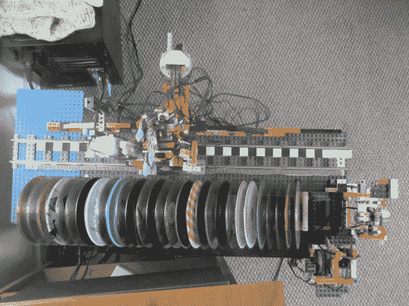

# 乐高自动点唱机选择不同的光盘

> 原文：<https://hackaday.com/2013/05/11/lego-jukebox-choses-from-different-cds/>

音乐过去是放在被称为光盘的圆形塑料片上播放的。[Ralph]仍然有一些他在最近的项目中用过的。这是一个用乐高积木搭建的 CD 换碟机。这让我们想起了上世纪中期的自动点唱机，它在一台电唱机上换出了 45 个。

从这张图片上你看不出来，但是整个换碟器的形状就像是放在一个电脑机箱上。该系统由两部分组成。有一个沿 CD 架左右移动的传送臂。它用黑白条纹作为编码器来跟踪它的运动。它可以伸进去，抓住一张光盘，然后一直拿到右边，把它放在一个中转区。现在，构建的第二部分接管，从暂存架上抓取光盘，并将其向下旋转到 PC 的 CD 托盘中。所有这些都是在跳跃之后展示的。

如果你和我们一样，你更喜欢你的音乐的数字传输。我们还没有越过视频游戏的分水岭，这就是为什么我们仍然喜欢这个 Xbox 360 换碟黑客。

[https://www.youtube.com/embed/qwUZc0ojLpI?version=3&rel=1&showsearch=0&showinfo=1&iv_load_policy=1&fs=1&hl=en-US&autohide=2&wmode=transparent](https://www.youtube.com/embed/qwUZc0ojLpI?version=3&rel=1&showsearch=0&showinfo=1&iv_load_policy=1&fs=1&hl=en-US&autohide=2&wmode=transparent)