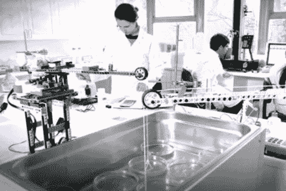

# 乐高思维风暴曾经自动化繁琐的实验室任务

> 原文：<https://hackaday.com/2012/04/19/lego-mindstorms-used-to-automate-tedious-laboratory-tasks/>

现代社会在很大程度上归功于医学研究，尽管在实验室幕后发生的事情通常远没有那么迷人。剑桥大学的一组科学家正致力于开发人造骨组织，但是创造用于研究的样本的过程极其繁琐。

为了制造骨骼，必须将亚结构浸入钙和蛋白质的混合物中，冲洗，然后浸入磷酸盐和蛋白质的混合物中……成百上千次。可以自动化这一过程的设备是可用的，但成本非常高，所以科学家们做了他们最擅长的事情，建造了一套机器人来为他们做工作。

他们的新骨骼制造装置是用乐高思维风暴套件建造的，这在几个方面是他们问题的完美解决方案。这些试剂盒相对便宜，易于构建，易于编程，并且能够连续几天精确地执行相同的功能。

现在，该小组可以专注于他们研究中更重要的方面，而不是浪费时间手动创建合成骨骼样本。

继续阅读，观看 2012 年谷歌科学博览会上展示的一段视频，展示了剑桥的工作人员是如何将一切整合在一起的。

[通过[使](http://blog.makezine.com/2012/04/17/synthetic-bone-generation-with-lego/)

[https://www.youtube.com/embed/WBEtUJmp05w?version=3&rel=1&showsearch=0&showinfo=1&iv_load_policy=1&fs=1&hl=en-US&autohide=2&wmode=transparent](https://www.youtube.com/embed/WBEtUJmp05w?version=3&rel=1&showsearch=0&showinfo=1&iv_load_policy=1&fs=1&hl=en-US&autohide=2&wmode=transparent)