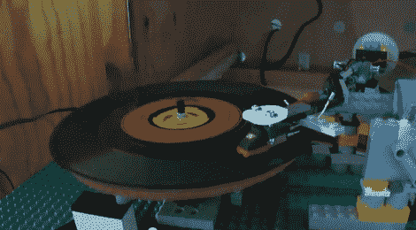

# 乐高电唱机

> 原文：<https://hackaday.com/2012/10/03/lego-record-player/>

有些人声称黑胶唱片的声音优于数字播放。虽然这个黑客不会赢得任何音频质量的奖项，但[Ryan]的[乐高电唱机](http://www.youtube.com/watch?v=LGhH20Lovcg "LEGO Record Player v2.0")是我们最喜欢的玩具之一的独特用途。包括拾音器臂、配重和底座在内的大部分部件都是由乐高积木制成的。一个来自教育建筑设置的大齿轮被用于浅盘。不幸的是，旋转不是非常平滑，播放相当失真。

该唱盘使用标准的唱头和唱针，这应该允许它连接到任何带有唱机前置放大器的接收器。使用这些现成的零件，就有可能用各种各样的东西来建造一个转盘的机械部件。正如视频演示的那样，让盘子正确转动是一个挑战。

休息过后，看看辛迪和伯特摇摆不定的回放视频。

通过[使](http://blog.makezine.com/2012/10/02/lego-record-player-2/ "Make")

[https://www.youtube.com/embed/LGhH20Lovcg?version=3&rel=1&showsearch=0&showinfo=1&iv_load_policy=1&fs=1&hl=en-US&autohide=2&wmode=transparent](https://www.youtube.com/embed/LGhH20Lovcg?version=3&rel=1&showsearch=0&showinfo=1&iv_load_policy=1&fs=1&hl=en-US&autohide=2&wmode=transparent)