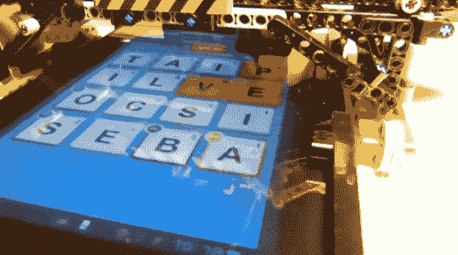

# 乐高手写笔解决 Ruzzle 平板游戏

> 原文：<https://hackaday.com/2013/02/19/lego-stylus-solves-ruzzle-tablet-game/>

这个字母网格是一个名为 Ruzzle 的平板设备益智游戏。附加的装置是[一个自动解算器，它使用乐高思维风暴部件](http://www.albertosarullo.com/blog/lego-plays-ruzzle)在屏幕上输入解决方案。[阿尔贝托·萨鲁洛]是该项目的幕后策划者。正如你在休息后的演示视频中看到的，他很有电影天赋。但是他让你做一些工作来发现他项目的细节。

他的文章概述了这是如何工作的。一个 Linux 盒子截图 Ruzzle 板。在用 Imagemagick 处理图形后，他使用 tessera CT——一种光学字符识别程序——来计算出游戏区域的每个方格上是哪个字母。从那里，NodeJS 被用来在字典文件的帮助下发现所有可能的单词。最终的解决方案被推送到乐高零件上，以便用触笔在触摸屏上描绘出来。好的一面是他发布了他所有的代码，所以你可以通过浏览他的库来更深入地研究这个项目。

[https://www.youtube.com/embed/ukPyJPFAwlo?version=3&rel=1&showsearch=0&showinfo=1&iv_load_policy=1&fs=1&hl=en-US&autohide=2&wmode=transparent](https://www.youtube.com/embed/ukPyJPFAwlo?version=3&rel=1&showsearch=0&showinfo=1&iv_load_policy=1&fs=1&hl=en-US&autohide=2&wmode=transparent)