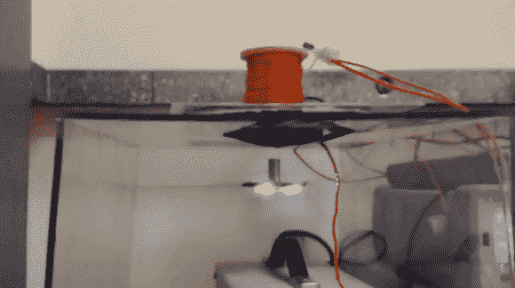

# 悬浮无线 LED 戒指

> 原文：<https://hackaday.com/2013/12/01/levitating-wireless-led-ring/>

这里有一个令人印象深刻的例子，一个完全自制的[磁悬浮装置](http://www.youtube.com/watch?v=1jrbv5coMCY) …带有无线电力传输启动！

[萨梅尔]从零开始建造它，它有两个主要的子系统，一个带反馈电子设备的电磁铁和一个无线能量传输装置。

发光二极管环有一堆钕磁铁，通过变化的磁场悬浮在适当的位置。这种悬浮是通过使用霍尔效应传感器和 PID 控制器实现的，PID 控制器使用 KA7500 SMPS 控制器。

无线电力传输使用工作频率为 800KHz 的 E 级 DC/交流逆变器。两个线圈在支架和 led 之间传递电流。

这与我们去年的一个版本非常相似，但它是一个很棒的黑客，所以我们必须分享它！休息之后请看视频。

[https://www.youtube.com/embed/1jrbv5coMCY?version=3&rel=1&showsearch=0&showinfo=1&iv_load_policy=1&fs=1&hl=en-US&autohide=2&wmode=transparent](https://www.youtube.com/embed/1jrbv5coMCY?version=3&rel=1&showsearch=0&showinfo=1&iv_load_policy=1&fs=1&hl=en-US&autohide=2&wmode=transparent)

对更多磁悬浮感兴趣？使用 Arduino 设计自己的系统怎么样？不然你可别忘了黑一天自己的[传送门枪！](http://hackaday.com/2012/10/11/hackadays-portal-gun-actually-levitates-a-companion-cube/)