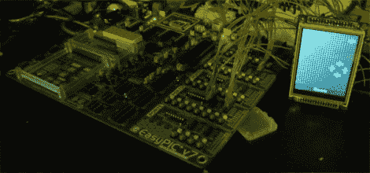

# 利用小型微控制器驱动 SSD1289 LCD 显示器的库

> 原文：<https://hackaday.com/2012/07/05/library-for-driving-ssd1289-lcd-displays-with-small-microcontrollers/>

[H. Smeitink]得到了一个 320×240 的彩色 TFT 液晶显示屏。他开始用一个小型 PIC 微控制器来驱动它，但没有找到很多帮助来快速启动和运行。这令人惊讶，因为这是一个非常好的显示器，价格相当低(在撰写本文时，易贝交付价格不到 16 美元)。他决定[编写自己的库和支持工具](http://www.hmsprojects.com/tft_lcd.html)来帮助他人。

显示器包括一个 SPI 触摸屏，但由于它独立于 LCD 控制器工作，因此该封装不支持触摸输入。他写的驱动程序来自于 mikroC 工具链的观点，但是移植到您选择的平台应该不会太难。我们快速地看了一下代码，似乎你需要做的就是调整定义来匹配你的硬件寄存器，并实现你自己的 delay_ms()函数。

但他没有和司机一起停车。您还会发现一个 C#程序，它将图像转换为数组，以便在显示器上使用。顺便说一句，这是[Sprite_TM]与树莓派一起工作的同一个显示器[。](http://hackaday.com/2012/06/25/sprite_tm-connects-an-lcd-to-a-tiny-linux-board/)