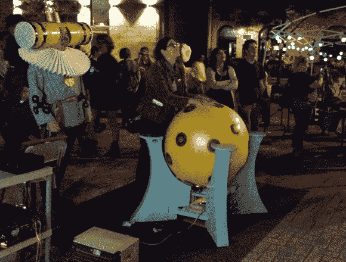

# 真人大小的 Katamari Damacy 球控制游戏，但不粘

> 原文：<https://hackaday.com/2013/06/25/life-sized-katamari-damacy-ball-controls-game-but-isnt-sticky/>

如果你从来没有听说过 *Katamari Damacy* 我们强烈建议你将这款游戏的副本与那台已经积满灰尘的 PlayStation 2 游戏机合二为一，然后和你剩下的夏天吻别。这个古怪的游戏由非常吸引人的背景音乐驱动(Na naaaah Na Na…)，围绕着一个吸引各种物体的球旋转。随着你积累的东西越来越多，这个球会从老鼠的大小变成房子的大小，甚至更多。也许这个游戏最大的吸引力是和一群人一起玩，这也是这个黑客击中目标的地方。它将游戏带到了伦敦的一个户外节日，视频投影在墙上，[这个真人大小的球作为控制器](https://iamarenaissancegeek.wordpress.com/2013/06/22/life-size-katamari-ball/)。

该项目使用了与 2009 年纽约电阻器的原始作品[相同的电子设备。那个项目最初想用一个 36 英寸的瑜伽球，但是他们不能完全达到目标。这个尝试确实让它发生了。舞会被装饰成了游戏的风格(还要注意主持人穿着戏服)。光电鼠标的内脏可以探测到运动。这由 Arduino 板处理，然后使用数字电位计模拟 PS2 控制器上的操纵杆运动。](http://hackaday.com/2009/05/25/katamari-controller/)

[https://www.youtube.com/embed/dC3KDbYVbKQ?version=3&rel=1&showsearch=0&showinfo=1&iv_load_policy=1&fs=1&hl=en-US&autohide=2&wmode=transparent](https://www.youtube.com/embed/dC3KDbYVbKQ?version=3&rel=1&showsearch=0&showinfo=1&iv_load_policy=1&fs=1&hl=en-US&autohide=2&wmode=transparent)