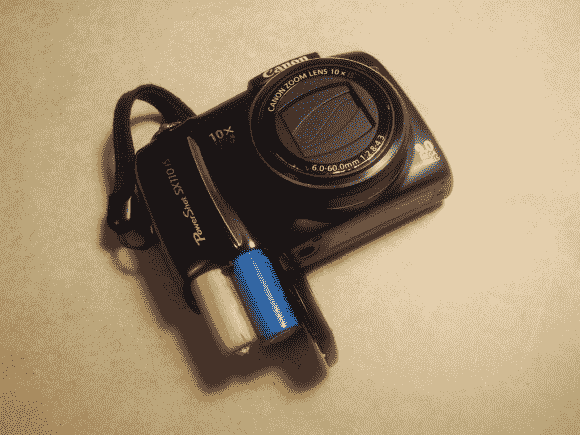

# 磷酸铁锂电池在相机中的表现比镍氢电池好得多

> 原文：<https://hackaday.com/2013/03/23/lifepo4-batteries-work-much-better-in-a-camera-than-nimh/>

我们同意[Zapmaker]的观点，佳能相机会啃噬镍氢电池。但是我们不打算用碱，因为我们认为它很浪费。他的解决方案是使用额定电压更高的电池。你在这里看到的是[一个单独的磷酸铁锂电池与一个虚拟电池](http://zapmaker.org/quick/ultimate-rechargable-aa-batteries-for-canon-camera/)配对，以增加充电之间的寿命。

镍氢电池持续时间不长的原因是它们的额定电压只有 2.4V。因为它们一开始就不是很高，所以用不了多久电压就会降到相机的截止阈值以下。但单个 LiFePO4 电池具有相同的外形，但产生 3.2V 电压，并在其放电周期内保持良好的电压。

大小是对的，但是用一个细胞自己不行。他为另一个插槽制作了一个填充物，这只是一个木钉，上面有一个螺丝贯穿其中。这个点被磨平了，还加了一点箔片以确保连接正确。我们很想听听这种产品的长期表现。