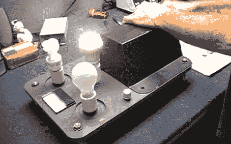

# LED 灯泡选项更新了灯泡效率展览

> 原文：<https://hackaday.com/2012/10/04/light-bulb-efficiency-exhibit-updated-with-led-bulb-option/>

似乎修补匠总是被用来建造或修理展品的硬件。这一次轮到[迪诺]了。他被要求[改变一个灯泡效率演示，以便它包括一个 LED 选项](http://hackaweek.com/hacks/?p=923)。

这里的想法是，你转动发电机为不同类型的灯泡供电。有一个内置的安培计，但可能最好的反馈是知道你有多努力去照亮最低效的选择。现在有一个拨动开关可以在白炽灯和 CFL 灯泡之间选择。[Dino 的]解决方案是使用三位旋转开关。他取下拨动开关，换上一个 LED 灯泡插座。为旋转开关选择了一个新的位置，他做了一些工作，使它安装牢固。如果你没有使用过这种类型的开关，他会在休息后花时间在视频中解释它们是如何工作的。