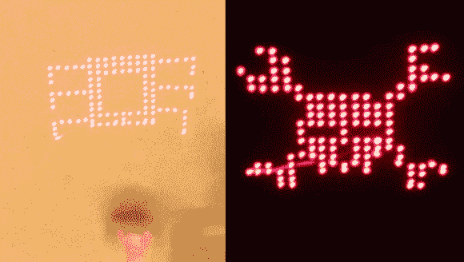

# 带有伺服系统和蟒蛇皮的灯光涂鸦

> 原文：<https://hackaday.com/2013/04/05/light-graffiti-with-servos-and-python/>

如果你有相当的艺术能力和敏锐的时间感，光涂鸦会很有趣。如果你没有必要的技能，你可以通过使用 Python 控制的伺服系统自动移动一切来弥补。Python 代码可以在这里找到，它利用 Python 图像库将图像处理成“可绘制”的形式。带有能够同步伺服控制的固件的[【py MCU】](http://pymcu.com/ "pyMCU")用于移动激光夹具。

这个实验的一个更困难的方面是获得每个激光脉冲之间的正确定时。计时程序涉及一点几何学，使用 trig 计算两者之间的距离。正如文章中所解释的，这可能有点矫枉过正。它仍然无法与之前实验中使用激光伺服夹具画圆的 trig 相比。休息之后，请务必观看该激光装置的运行视频。我对结果非常满意，并期待着将来能用它做些什么！

感谢[pyMCU]让我有几块这样的板子玩！

[https://www.youtube.com/embed/CGh88G0kc3g?version=3&rel=1&showsearch=0&showinfo=1&iv_load_policy=1&fs=1&hl=en-US&autohide=2&wmode=transparent](https://www.youtube.com/embed/CGh88G0kc3g?version=3&rel=1&showsearch=0&showinfo=1&iv_load_policy=1&fs=1&hl=en-US&autohide=2&wmode=transparent)

[https://www.youtube.com/embed/x_U2jqG_fRA?version=3&rel=1&showsearch=0&showinfo=1&iv_load_policy=1&fs=1&hl=en-US&autohide=2&wmode=transparent](https://www.youtube.com/embed/x_U2jqG_fRA?version=3&rel=1&showsearch=0&showinfo=1&iv_load_policy=1&fs=1&hl=en-US&autohide=2&wmode=transparent)