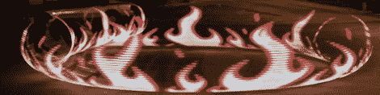

# 用锉刀轻画

> 原文：<https://hackaday.com/2012/08/14/light-painting-with-the-raspi/>

这些年来，使用闪烁的 RGB LEDs 拍摄长曝光照片的技术已经有了很大的提高，这主要是因为 Arduino 非常容易使用，而且网上有数百个教程。如果说用“duino”进行光线绘画有一个问题，那就是大型全彩色图像会占用大量存储空间，远远超过 Arduino 上的闪存所能提供的空间。想要更花哨、更多彩的光绘图像，Adafruit [的[Phil]用树莓皮](http://learn.adafruit.com/light-painting-with-raspberry-pi/overview)制作了一些非常棒的光绘图像。

像任何使用 LED 的 Adafruit 教程一样，构建从连接到 Raspi 上 GPIO 引脚的[数字 RGB LED 条](http://learn.adafruit.com/digital-led-strip)开始。在加载了用于硬件 spi 支持的[Adafruit educational Raspi Li](http://learn.adafruit.com/adafruit-raspberry-pi-educational-linux-distro/overview)[nux distro](http://learn.adafruit.com/adafruit-raspberry-pi-educational-linux-distro/overview)之后，剩下要做的唯一一件事就是编写 Python 脚本来在空中显示图像。

[Phil]说垂直的、手持的 LED 棒是旧帽子，所以他拿了一个呼啦圈和一些 PVC 管，附上 LED 条，[把它放在他的自行车上](http://learn.adafruit.com/light-painting-with-raspberry-pi/motion-rig)。结果真的令人印象深刻——我们喜欢标题图片中的火焰——考虑到 Raspi 是一台成熟的计算机，比[Phil]制作的更大的光绘是非常可能的。