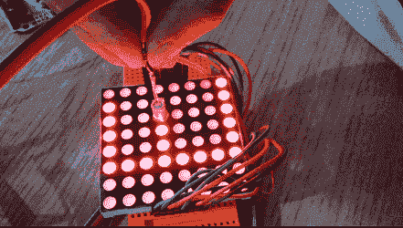

# 光笔在 LED 矩阵上绘图

> 原文：<https://hackaday.com/2014/07/09/light-pen-draws-on-led-matrix/>

当你可以拥有一个 8×8 的 LED 矩阵时，谁还需要一个 1920×1080 的有机发光二极管显示器呢？这是[Kathy]在构建这个 [LED 矩阵光笔项目时提出的问题。](http://www.elecfreaks.com/7138.html)它看起来很简单——当笔画出形状时，64 个 LED 矩阵会发光。但是电路怎么知道笔下面是哪个 LED 呢？好的老式矩阵扫描是答案。任何时候都只有一个 LED 亮起。

[Kathy]使用了一对 74LS138 3 至 8 行解码器来扫描矩阵。’138 上的低电平有效输出非常适合普通阴极矩阵。当然[Kathy]只有一个公共阳极矩阵，所以 8 个 PNP 晶体管被用作反相器。

笔本身是一个光电晶体管。[Kathy]最初尝试了 CdS 光敏电阻，但发现它对于矩阵扫描来说有点太慢了。LM358 运算放大器用于将信号提高到 Arduino Uno 可以检测到的合理水平。

对于这样一个简单的设计，结果是令人印象深刻的。我们很乐意看到有人使用这个平台作为一个史诗蛇游戏的开始。