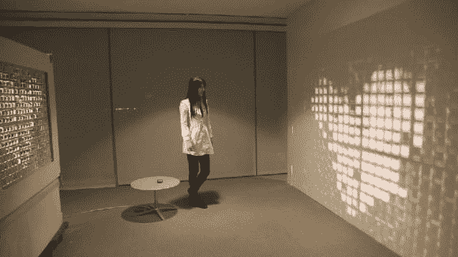

# 光字节:动画百叶窗

> 原文：<https://hackaday.com/2014/04/03/lightbyte-animated-shutters/>

这是来自麻省理工学院媒体实验室的另一个有趣的项目——它被称为 [LightByte](http://augmentingnature.com/) ，它是关于以一种新的，相当非正统的方式与阳光和阴影互动。

我们认为它的技术名称可能是一个巨大的交互式太阳像素立面，但这有点太拗口了。你真正想知道的是它是如何工作的，答案是，很多伺服系统的**。我们无法找到一个确切的数字，但 LightByte 背后的硬件包括 100 多个伺服系统，以及控制它们的 Arduinos 矩阵。虽然这本身就很令人印象深刻，但它会变得更好——它实际上是完全交互式的；识别手势，回复短信和电子邮件，甚至可以用附带的“魔杖”画画。**

**[https://player.vimeo.com/video/86385864](https://player.vimeo.com/video/86385864)

我们喜欢像这样的机械——正是机械快门让它们如此令人敬畏。当然，反向工程的[翻转点显示器也很酷！](http://hackaday.com/2013/11/04/hacking-a-flip-dot-display/)或者像这样的大型自制[翻转点显示器……](http://hackaday.com/2012/07/19/flip-dot-display-is-an-advertising-experience-we-can-get-behind/)

【谢谢亚历山大！]**