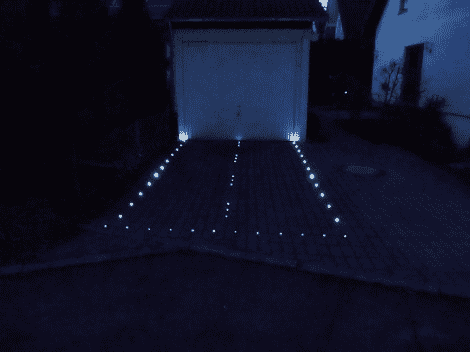

# 照亮了通往车库的跑道

> 原文：<https://hackaday.com/2012/05/25/lighting-up-a-runway-into-the-garage/>

[提莫]不想看起来像每一个其他照明车道，但使用太阳能路灯。相反，他决定点燃它，就像它是一条跑道一样。很容易把结果看得很可爱，然后继续下一次攻击。但是再看看。如果你打算自己做这件事，考虑到一辆汽车会从上面驶过，而且是在户外，你会如何实施呢？

在这种情况下，保护它不受流量影响的第一个问题实际上并不太难。[提莫的]车道是由铺路材料制成的，而不是由沥青或混凝土制成的实心板材。他钻出一些交叉点，为他蚀刻的每个 PCB 留出足够的空间来容纳 led 和驱动器。这些电路板像鳍一样水平插入摊铺机之间的沙子中，表面贴装 LED 沿边缘放置。电源线和控制线沿着每一排灯延伸。它们是串行控制的，减少了所需的导线数量。[Timo]没有提到防风雨，但我们建议用水晶般透明的树脂铸造它们[，就像这个耳机放大器](http://hackaday.com/2012/04/13/free-formed-circuit-protected-by-a-brick-of-crystal-clear-resin/)。