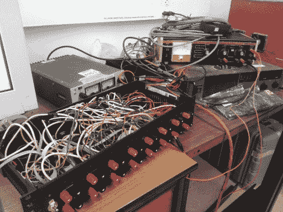

# 太阳能汽车电池阵列脂电池测试仪

> 原文：<https://hackaday.com/2012/06/27/lipo-battery-tester-for-solar-vehicle-battery-array/>

如果你正在制造具有竞争力的太阳能汽车，你必须确切地知道蓄电池的性能。为此，马修建造了一个锂聚合物电池测试仪，供麦克马斯特大学太阳能汽车项目使用。它运行良好，但一次只能测试一块电池。他刚刚完成了第二个版本，[可以一次测试多达八个单元的电池规格。它节省了大量时间，但仍然需要 15 个小时来测试车辆使用的一组单元。](http://matthack.com/battery-benchmark-circuit-v8-0/)

被测量的最重要的方面是放电曲线。当然，数据手册中包含了这些信息，但你怎么能确定你收到的东西会按规格运行呢？八个通道中的每一个都可以使用继电器从系统中断开。这只是安全功能之一，用于监视过压和过流等情况。请记住，如果出现问题，锂电池会很快变热。数据在 12 位 ADC 上采样，并可以通过 USB 传输到计算机进行绘图。