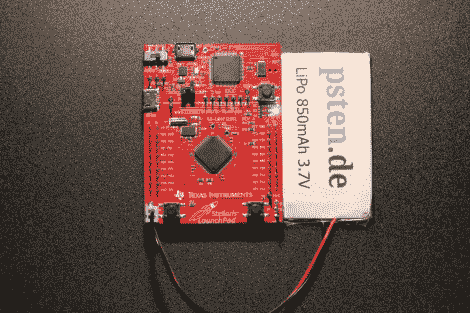

# 脂肪动力 Stellaris 发射台

> 原文：<https://hackaday.com/2012/10/16/lipo-powered-stellaris-launchpad/>

想要 Stellaris Launchpad 开发板的移动电源吗？[菲利普]希望为发射台增加一些[锂动力。他使用现成的单电池脂电池，并将其连接到 Launchpad 板的 5V 轨道。没用。](http://blog.psten.de/post/fuel-for-the-stellaris-rocket "Fuel for the Stellaris Rocket")

所以[菲利普]开始查看图表，注意到调节器工作正常，但 Stellaris 无法启动。他找到了一个连接到 Stellaris 复位引脚的电压监控器。经过一番调查，很明显，这位主管将设备置于复位状态。

解决方案是一个快速而肮脏的方法:切断连接复位线和电压线的线路。通过这种修改，设备从 LiPo 启动，没有任何问题。[Philipp]确实指出，您应该小心电池欠压和过压。这个黑客不处理 LiPo 电池的充电，但我们在过去的中已经讨论过这个问题。