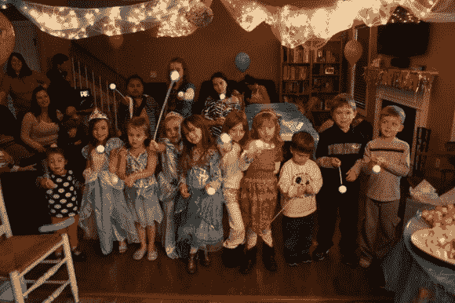

# 小妹妹的爱好电子党的青睐

> 原文：<https://hackaday.com/2013/01/15/little-sisters-turn-for-hobby-electronic-party-favors/>

大伊恩·李为他女儿的生日派对做了些特别的东西。这个年龄的女孩(这是她的 5 岁生日)被公主的故事迷住是很常见的，所以他为每个派对客人做了一个闪闪发光的公主魔杖。当她问他要为她的庆祝会做什么特别的事情时，动力来了。你可能还记得今年早些时候在她哥哥的派对上看到的 [LED 徽章套件](http://hackaday.com/2012/11/12/birthday-badges-teach-kids-how-to-solder/)。从参加聚会的客人来看，他肯定满足了她举办一次难忘聚会的愿望。

该项目非常便宜，非常容易组装，可能会成为监管幼儿园的完美工具包。它基本上是一个 LED 投掷器，外加一根棍子和一根羽毛。[Ian]使用 CR2032 电池以及 LED 和限流电阻来照明。他剪掉了 LED 的一条腿，并通过将 LED 焊接到位来替换它。剩下的导线被压在硬币电池的两边，整个东西被塞进气球棒末端的一个切口里。整件事被一个橡皮筋紧紧包裹，然后被一个乒乓球包裹。为了修剪它，他在球的底部热粘了一根羽毛。

唯一让我们担心的是他明年会做什么来超越这些政党。