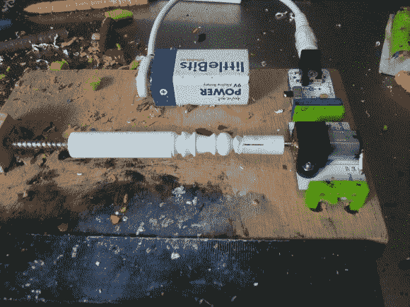

# 小车床

> 原文：<https://hackaday.com/2014/01/26/littlebits-little-lathe/>

对于一个你羽翼下的年轻黑客，你需要一个实用、有用、好玩的项目吗？让他们体验一下电子产品，组装一台小车床来定制他们的蜡笔怎么样？老实说，这算不上什么电子黑客，但它确实利用了 [LittleBits 电机模块](http://littlebits.cc/bits/dc-motor)和你可能有的所有旧蜡笔。你可以让这个周末项目与孩子们分享，而且你永远不知道什么会激发一个年轻工程师的兴趣。

如果你不熟悉 LittleBits，它们是小型电子模块，可以通过磁性咬合在一起构建更大的电路。模块按功能进行颜色编码，带有不可逆磁性连接器，帮助小家伙了解如何连接和集成模块。这些 LittleBits 套件非常适合年轻的电子初学者或任何年龄的人。单独来说，这些模块非常昂贵，但这些部件非常值得，因为孩子们会发现该系统使用起来很直观，而且这些模块在粗心的孩子手中也很耐用。更划算的购买方式是从 Adafruit.com 购买[套件。](http://www.adafruit.com/category/95)

在这份说明书中，[maxnoble440]展示了使用各种工具转动蜡笔的小车床，从非常锋利的工具到“老少皆宜”的工具齿轮传动的 LittleBits 电机转动缓慢，似乎有足够的扭矩雕刻蜡笔——可能还有粘土——包装在一个小销钉周围。要建造这个项目，你需要“一点点”木工技能来建造迷你车床床身。所有的说明都可以在 Instructable 中找到，还有一个简短的视频，您可以在休息后观看。

[https://www.youtube.com/embed/AzTEHW8CUt4?version=3&rel=1&showsearch=0&showinfo=1&iv_load_policy=1&fs=1&hl=en-US&autohide=2&wmode=transparent](https://www.youtube.com/embed/AzTEHW8CUt4?version=3&rel=1&showsearch=0&showinfo=1&iv_load_policy=1&fs=1&hl=en-US&autohide=2&wmode=transparent)