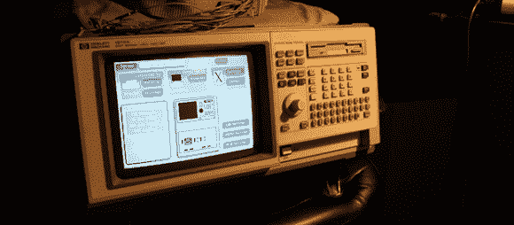

# 逻辑分析仪和 X11

> 原文：<https://hackaday.com/2013/12/05/logic-analyzers-and-x11/>

[Andrew]最近获得了一台超棒的惠普 1670A 深度内存逻辑分析仪，幸运儿。尽管这台机器是在 1992 年制造的，但它是当时的顶级设备，有一些非常有趣的功能。这个逻辑分析仪也有几个网络端口，通过 10Base2(“thin LAN”)和 10BaseT(“ether twist”)连接实现 FTP、NFS、TCP/IP 和 X11 协议。X11 协议引起了[Andrew]的兴趣，所以[他安装了这个逻辑分析仪，这样他就可以通过他的 Linux 机器使用它。](http://www.theresistornetwork.com/2013/12/a-testament-to-x11-backwards.html)

Windows 只是一种通过网络显示 GUI 界面的方式。虽然今天我们通常只看到局限于桌面的 X Windows 应用程序，但在过去 X 必须付费的糟糕日子里，通过网络运行 GUI 应用程序被认为是未来的潮流。互联网用 JavaScript 的[重写本](http://en.wikipedia.org/wiki/Palimpsest)取代了这个想法，但是我们离题了…

[Andrew]的新玩具不支持 DHCP，所以手动输入 IP 地址后，他检查了主机文件——二十年后还是一样——并与他的 Linux Mint box 连接。其结果是一个为“ol 女孩”设计的遥控面板，其花哨的配色方案违背了所有现代人的感受。