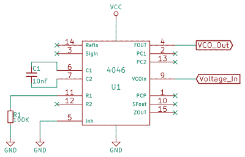
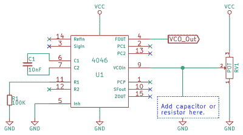

# 逻辑噪声:4046 压控振荡器，第一部分

> 原文：<https://hackaday.com/2015/08/07/logic-noise-4046-voltage-controlled-oscillator-part-one/>

在这一节逻辑噪声课中，我们将摆弄来自 4046 锁相环芯片的[压控振荡器](https://en.wikipedia.org/wiki/Voltage-controlled_oscillator)，并使用它来制作“音乐”音高。这是一个巨大的进步，让我们走上了未来更有趣的赛道。因此，请在休息后立即观看介绍视频，我们将直接进入主题。

[https://www.youtube.com/embed/ndFktKDXIDI?version=3&rel=1&showsearch=0&showinfo=1&iv_load_policy=1&fs=1&hl=en-US&autohide=2&wmode=transparent](https://www.youtube.com/embed/ndFktKDXIDI?version=3&rel=1&showsearch=0&showinfo=1&iv_load_policy=1&fs=1&hl=en-US&autohide=2&wmode=transparent)

## 4046 锁相环

4046 锁相环(PLL)芯片是一个很好的实验芯片。事实上，它是如此的多才多艺，以至于我们将在接下来的三节课中探索它。尽管如此，我们只是触及了表面。Hackaday 自己的 [Bil Herd 也爱上了 4046](http://hackaday.com/2011/06/21/pll-101/) ，我们已经在之前发布了关于使用它的[教程。我们不会在这里使用芯片的任何预期功能，所以当你完成制作 bleepy-bloopy 声音时，请检查这些链接。](http://hackaday.com/2012/02/15/intro-to-phase-locked-loops/)

PLL 是很好的电路。正常使用时，输入具有给定频率的波形，PLL 输出与输入同步的方波，但频率更高。它的工作原理是内置一个压控振荡器(VCO ),并用一个电压信号驱动 VCO，该电压信号取决于内部 VCO 和外部信号之间的频率差。到目前为止，通过根据失步程度改变内部 VCO 的电压，可以同步内部和外部波形。

获得倍频的技巧是对内部 VCO 的输出频率进行分频，比如四分频，然后将分频结果与输入同步。当四分之一速度 VCO 信号与输入同步时，直接 VCO 信号的运行速度是输入的四倍。瞧，一个倍频器。

## 最简单的 VCO

这非常聪明，但对于本次会议，我们将只使用内置 VCO。这是对电压控制世界的一个快速而肮脏的介绍，至少自 1960 年代以来，电压控制一直是现代合成器工作的原因。

[https://www.youtube.com/embed/4AYjbMjtYBA?version=3&rel=1&showsearch=0&showinfo=1&iv_load_policy=1&fs=1&hl=en-US&autohide=2&wmode=transparent](https://www.youtube.com/embed/4AYjbMjtYBA?version=3&rel=1&showsearch=0&showinfo=1&iv_load_policy=1&fs=1&hl=en-US&autohide=2&wmode=transparent)

为了使用 4046 的 VCO，我们将只使用它的 16 个引脚中的几个。VCO 有一个抑制引脚，即引脚 5，我们需要将它与常用的 VCC 和 GND 引脚一起接地。VCO 的电压输入在引脚 9 上，输出在引脚 4 上。最后，通过分别选择引脚 6 和 7 上的电容以及引脚 11 和 12 上的频率(以及可选的失调)电阻来控制频率范围。

 从这里的示意图可以看出，这是一个显而易见的问题。一个 10nF 的电容和一个 100K 的选频电阻就能很好地工作。由于这两者的乘积控制中心频率，因此也可以使用一个 100nF (0.1uF)电容和一个 10K 电阻。根据数据手册，10K 和 1 兆欧之间的任何电阻值都可以。如果您想稍后调整中心频率，也可以在这里使用 100K 的电位计。

失调电阻(R2)有一个额外的(可选)复杂性。在这里增加一个接地电阻会向上移动整个频率范围，如果您希望最小频率不是零，这很好。失调电阻必须大于上述频率选择电阻，但也可以是无穷大。这将是 1 米或 10 米电位计的绝佳位置。我们现在跳过它。

仅此而已。两个外部元件，一个电阻和一个电容，就得到一个压控方波振荡器。现在我们只需要一个电压源来控制它。首先，连接一个电位计作为分压器。一端连接到 VCC，另一端连接到 GND，中间(游标)端连接到 VCO 的电压输入。不过，它的功能与之前的电阻调谐振荡器大致相同。

## 电压控制

将 synth 部件置于电压控制之下的乐趣在于制造控制电压的古怪来源。用手指转动旋钮很好，但将这一职责交给一些电路更好。简而言之，这就是[将合成器带出实验室](https://en.wikipedia.org/wiki/Moog_synthesizer)并诞生作为乐器的现代合成器的原因。在本视频中，我们使用一个间歇电压源——一段 VHS 录像带和一个用作分压器的鳄鱼夹——来说明 VCO 可以实现的一些功能，而我们的电阻控制版本则无法实现。

[https://www.youtube.com/embed/5wiU7z15HWI?version=3&rel=1&showsearch=0&showinfo=1&iv_load_policy=1&fs=1&hl=en-US&autohide=2&wmode=transparent](https://www.youtube.com/embed/5wiU7z15HWI?version=3&rel=1&showsearch=0&showinfo=1&iv_load_policy=1&fs=1&hl=en-US&autohide=2&wmode=transparent)

您会注意到电压输入非常敏感。事实上，当它没有连接到任何东西时，它会疯狂地改变频率，因为它会接收到电力线干扰。我们认为噪音很大，但如果你在做音乐，你必须将所有其他乐器调到电力线频率。在视频中，我们用两种方法解决这个问题。

 首先，在 VCO 的电压输入端增加一个电容，暂时保持最后的电压。这使得最后一个音符即使在我们的手指从琴键上移开，或者从 VHS 录像带上拿走 croco 剪辑后也能继续播放。第二，增加一个接地电阻，最好是一个相当大的电阻，这样就不会拉低控制电压电平，从而在动作之间抑制 VCO。将两者混合会产生一个缓慢衰减的音调。(那有没有用就看你自己了。)

滑音，音符之间音高的滑动，也可以只用一个电容器来实现，尽管速度取决于你用作电压源的输出阻抗，所以不完全可靠。有更好的滑音电路，但它们可能涉及运算放大器。

顺便提一下，你可以用一堆按钮和电压源做一个简单的键盘。事实上，一个很好的设备是一组按钮，连接到相同数量的电位计，电位计配置为分压器，就像我们在第一个演示中所做的那样。能够独立调整每个键弥补了没有太多可用的键，这意味着您可以在任何您喜欢的音阶中演奏。

## 电压控制警报器

现在让我们做一件用电阻作为控制元件绝对做不到的事情:用另一个振荡器控制 4046 的振荡器的频率。

[https://www.youtube.com/embed/FTLAaVgY2m8?version=3&rel=1&showsearch=0&showinfo=1&iv_load_policy=1&fs=1&hl=en-US&autohide=2&wmode=transparent](https://www.youtube.com/embed/FTLAaVgY2m8?version=3&rel=1&showsearch=0&showinfo=1&iv_load_policy=1&fs=1&hl=en-US&autohide=2&wmode=transparent)

 为此，我们将使用我们的老朋友 40106 构建一个振荡器。使用一个漂亮的大电容(10uF 是好的)，以便它有一个漂亮的缓慢摆动。我们不是分接输出，而是分接输入，输出中有一个全范围方波，输入中有一个模拟三角波，可以在 40106 的迟滞电压阈值之间轻松跳跃。

 这是一个简单而完美的组合。4046 的电压输入根本不消耗太多电流，因此我们可以将其无缓冲地连接到 40106 的三角波/输入，而不改变频率。三角波也不会在整个范围内摆动，这很好，因为 4046 将在低于 1.4V 左右时完全停止振荡。通过一个旋钮，您可以创建一个缓慢的警笛般的效果，或将调制三角波提升到音频水平，并播放疯狂的调频(FM)类型的声音。

因为连续电压源很快就会变得单调，所以我们在视频的末尾添加了一个按钮。这也让我们展示了我们以前使用的电压保持和电压衰减技巧。另外，增加一个开关和一个电容会直接引入采样保持电路，这是下一节的主题。

## 样本及保存

[https://www.youtube.com/embed/3y97KR0U9SA?version=3&rel=1&showsearch=0&showinfo=1&iv_load_policy=1&fs=1&hl=en-US&autohide=2&wmode=transparent](https://www.youtube.com/embed/3y97KR0U9SA?version=3&rel=1&showsearch=0&showinfo=1&iv_load_policy=1&fs=1&hl=en-US&autohide=2&wmode=transparent)

 采样保持(S & H)是一个奇特的电子工程师术语，用于将一个电容器和一个开关放入电路中，但它是合成器中一个很酷且有用的效果。事实上，合成器至少可以追溯到最初的 Moog 模块，上面有一个 S & H 电路。为什么？这是一种廉价且令人愉快的近乎随机的来源。

因此，我们将在 40106 芯片上连接第二个时钟频率振荡器，这次使用方波输出。用 4066 数字开关替换我们的按钮，将 S&H 置于振荡器控制之下。当 4066 开关闭合时，电容器 C2 为振荡器充电，当开关打开时保持充电。目前，电路采样的时间(按钮开关闭合)与电路保持的时间(开关断开)相同。现在，我们将坚持最基本的。

这里实际上有三种电路变型很有趣。第一个是直接采样保持电路。当采样保持振荡器为高电平时，开关闭合，VCO 跟踪音高振荡器，当 S&H 振荡器变为低电平时，音高保持在之前的水平，就像我们手动操作时一样。

另一个巧妙的效果是用一个下拉电阻(比如 100K)代替 S&H 电容(C2)。现在，当按钮未被按下时，电压被拉低，VCO 进入静默状态。这使得一个很好的断奏声音只播放 50%的时间，其中音高跟踪音高振荡器。

### S&H 行为

如果快速运行控制电压振荡器(如第一个窗格)，然后相对缓慢地采样，则很难预测采样电压的最终值。这是因为控制电压振荡器在采样周期内变化很大。像这样从快速变化的时钟源进行缓慢采样是一个很好的技巧。

如果您反其道而行之，从缓慢移动的源电压频繁采样，您会得到这种阶梯效应，它描绘出三角波的大致轮廓，但沿途保持离散的音高，如上面的中间窗格所示。

在中间区域，两个振荡器以相当的速度运行，采样发生在控制波中或多或少相似的位置。在上面的第三个窗格中，当开关闭合时，你只能看到电容器随着控制电压移动，但这一切都融合在一起。我们真的很喜欢完全有序和完全混乱之间的区域，所以这是我们喜欢玩的地方。

在现实世界中，模数转换器等设备上的 S&H 电路使用非常短的采样脉冲和微小的低泄漏电容器，这些电容器可以快速充电，因此更像是在给定时刻拍摄电压的快照。他们还使用特殊的数字开关，开关速度非常快，并且在关闭时具有极高的阻抗。如果你想用我们的设置做一些类似的事情，你可以把方波转换成脉冲波，就像我们以前对钹和鼓电路所做的那样。尝试不同的电容值来延长或缩短脉冲长度。

## 下一次会议

我们正享受着用 VCO 制造音调噪声的美好时光。但是我们仍然没有弹奏音阶。为了向音乐性迈出下一步，我们需要在电压缩放上努力。当固定的电压增量为您提供固定的音阶步长时，制作音乐会容易得多。现在，情况并非如此，下次我们将陷入整个混乱。值了。

但现在，享受疯狂的电压控制的曲调/噪音。