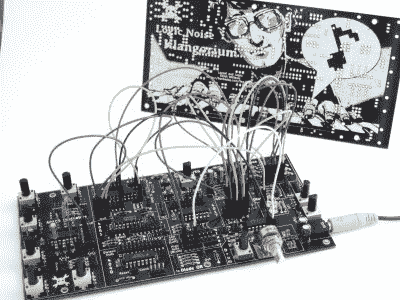
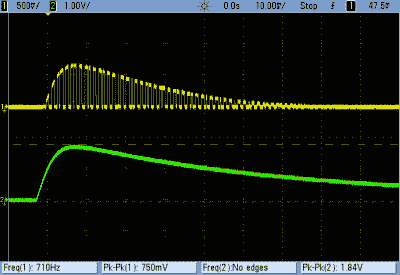
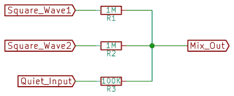
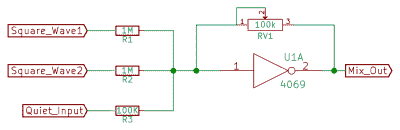
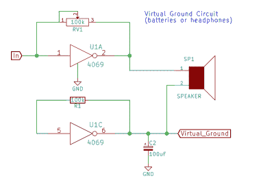
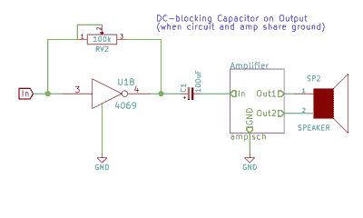
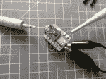
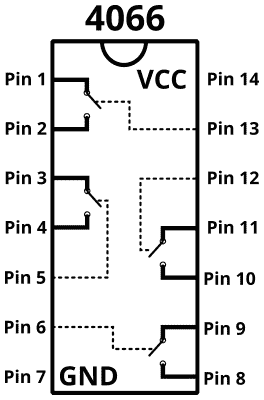
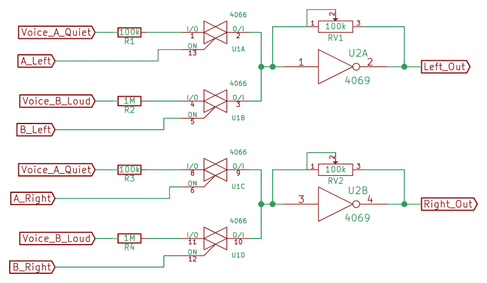

# 逻辑噪声:乒乓立体声、混音器等等

> 原文：<https://hackaday.com/2015/07/02/logic-noise-ping-pong-stereo-mixers-and-more/>

到目前为止，在逻辑噪音上，我们已经[建立了一堆](http://hackaday.com/2015/02/17/logic-noise-8-bits-of-glorious-sounds/)的[发声](http://hackaday.com/2015/04/10/logic-noise-more-cmos-cowbell/)，并且用[给它们排序](http://hackaday.com/2015/04/24/logic-noise-sequencing-in-silicon/)。我们有几次[将声音组合在一起](http://hackaday.com/2015/05/04/logic-noise-taming-the-wild-shift-register/)，我们都是使用最简单的无源混音器——一堆电阻。虽然这可能行得通，但我们大多只是运气好。在本次会议中，我们将更加认真地对待系统输出，构建一个有源混频器和简单的立体声耳机驱动电路。

为此，我们需要一些放大器，我们的老朋友 4069UB 将承担所有的重任。老实说，本周的电路只是我们之前看到的缓冲放大器和可变过驱电路的详细阐述。为了保持有趣，我们将探索乒乓立体声效果，并最终(当然)将平移置于逻辑电平控制之下，这很荒谬，而且主要是引入另一种有用的开关 IC 4066 四通道开关的借口。

在文章的最后是到目前为止我们所做的所有事情的清单。如果你一直在跟进，只是想从一家电子产品供应商那里一次性订购，那就去看看吧。

如果你想知道为什么延迟推出这一期的逻辑噪声，部分原因是因为我已经建立了一个 PCB，它将我们迄今为止所做的一切基本上纳入了一个准模块化逻辑噪声演示的发电站——[Klangorium](https://hackaday.io/project/6540-logic-noise-klangorium)。我们的想法是从迄今为止的每个逻辑噪声列中获取材料，并构建电路板，使每个实验变得容易。

一切都是开放的和有文档记录的，它本质上是模块化的，所以你可以自由地从项目中获取你想要的东西。也许你想硬连线钹电路，或者也许你想交换一些零件。复制我们的或者建立你自己的。如果有，请告诉我们！

好了，介绍够了，让我们开始吧。

[https://www.youtube.com/embed/Aw7jZ_J2cMk?version=3&rel=1&showsearch=0&showinfo=1&iv_load_policy=1&fs=1&hl=en-US&autohide=2&wmode=transparent](https://www.youtube.com/embed/Aw7jZ_J2cMk?version=3&rel=1&showsearch=0&showinfo=1&iv_load_policy=1&fs=1&hl=en-US&autohide=2&wmode=transparent)

## DC 偏压

当空气中的压缩波到达我们的耳朵时，我们把它们感知为声音。我们通过来回推拉扬声器纸盆来进行压缩。为了让锥体移动，我们需要让电流通过扬声器的磁铁绕组向一个方向流动，然后向另一个方向流动。

为什么要回归基本面？因为重要的是要把我们要放大的电压和电流想象成双极性的，在某个中心电压电平附近振荡。当信号电压高于中性线时，电流单向流动，锥体被推动。当信号较低时，电流向相反方向流动，锥体被拉动。我们将围绕其振荡的中性电压被称为 DC 偏置(或电平)电压。

在逻辑噪声过程中，我们尽可能忽略 DC 偏置电压，但在将几个信号混合在一起时，我们不能再这样做了，因为信号只有在相对于相同偏置电压产生时才能正确相加。

 我们以前没有阻挡 DC 电压，因为我们的方波和三角波信号偏置在 VCC/2 附近，就像用 4069UB 反相器构建的反馈放大器一样。这一切都很好，直到我们引入了鼓和钹电路，这是如此奇怪，他们甚至没有一个明确定义的 DC 水平。

阻断 DC 电压只需将信号通过一个电容即可。多大？足够大，加上音频链中下一级的输入电阻，它不会过多地影响我们的低频元件。对于 4069UB 输出放大器级，1 微法电容就足够了。

现在，让我们假设我们首先消除想要混合在一起的任何信号的 DC 电平，注意对于全摆幅方波，我们可以“摆脱它”。现在是开始混音的时候了。

## 混频器:无源和有源

### 无源混频器

 “无源混频器”是一个两美元的名字，通过电阻将信号组合在一起。在其他条件相同的情况下，电阻值越高，对整体混音的影响越小。

这是将几个信号加在一起的最简单的方法，无论如何，你应该尝试被动混音，只是为了找到感觉。让无源混频器工作的关键是对所有混频输入使用相对较大的电阻。

简单无源混频器的缺点是，由于所有信号都在接合点处合并，一个信号会影响其他信号。本质上，每个输入信号都可以将结的电压拉高或拉低，然后通过输入电阻反馈到其它“输入”。无源电阻混频器非常简单，但它们无法很好地隔离信号源。

### 预炼混铁炉

主动混音的诀窍是添加负反馈。除此之外，它只是与无源混频器相同的电路，但要好得多。

 还记得在[关于滤波器](http://hackaday.com/2015/03/25/logic-noise-filters-and-drums/)的课程中，逆变器的作用就像试图将输入引脚上出现的任何净输入信号电流归零一样；其逻辑是，如果输入端的电压升至开关点以上，输出会变低，并通过反馈路径将其再次降下来。

反馈中电阻的大小决定了逆变器抵消输入信号的努力程度。更多的反馈电阻会导致逆变器输出的电压摆动更大，最终会在我们的耳机中产生更大的音调，因此反馈路径是添加主音量控制旋钮的绝佳位置。

在无源混频器示例中，当一个输入为高电平时，它会提高结点处的电压，然后通过输入电阻“回流”到其它相连电路。在有源混频器中，当一个输入为高电平时，反相器会通过降低总混频输出电压来消除它，直到反相器的输入再次位于其中点。通过负反馈机制，所有求和电阻的连接点保持在恒定的中点电压，任何输入都不会相互影响。只有输出电压摆动。

在这里，我们看到了从输入信号中消除 DC 电平的需要——4069 ub 将通过推动电流通过反馈环路，尽一切努力将其输入保持在大约 VCC/2。每个输入电阻前的一个 1uF 电容会解决这个问题。

除了隔离输入之外，我们还可以通过改变反馈电阻值来控制有源混频器的增益。这为我们插入主音量控制提供了一个简单的地方，只需用电位计替换反馈电阻即可。不应低估主音量旋钮的便利性。

如果你要混合信号，并且有电可以支配，你几乎总是想要一个有源混频器。

### 多输入体积

混音器的主要功能是让一堆音量不同的声音很好地播放在一起。例如，40106 振荡器的方波输出完全从 GND 摆动到 VCC，而来自同一振荡器输入的(无缓冲)三角波则安静得多。低音鼓电路本质上也相当安静，给予钹打击包络的 VCA 输出仅摆动几伏。从美学角度来说，你需要调整每个不同声源的音量。

 录音室的混音控制台由一排令人印象深刻的推子控制，这些推子可以微调单个音轨的音量。但在我们最终投资数百美元的高档电位计之前，让我们看看一堆 1 美分的电阻能让我们走多远。

让我们像工程师一样思考一下这个问题。无论是线路电平输入还是耳机，我们都希望输出信号的峰峰值在 1 伏左右。这意味着，如果我们看到的是 9V 峰峰值方波，我们希望将其降低约十分之一。另一方面，我们从低电平信号中获得的 1 或 2 伏峰峰值电压似乎可以通过简单的单位增益缓冲来实现。(记住，这都是在全局输出音量控制旋钮之前。)

如果我们对可变反馈电阻(和总音量)使用 100k 电位计，这意味着我们可以对高音量数字信号使用大约 1M 欧姆的电阻，将幅度降低至少十分之一。对较安静的信号使用 100k 欧姆的电阻意味着当通道的音量旋钮调到最大时，它们将以单位增益通过。当然，您可以通过选择不同的电阻值来调整这些值，以符合您的确切偏好。

因此，收集一些产生噪声的器件，选择一些输入电阻值，使它们一起听起来很好。(记住必要时用电容移除 DC 电平。)如果最终结果可行，没有人会知道你没有花几百或几千买一个混音版。

### 耳机输出和线路输出

我们看到了输入端的 DC 偏差问题，而输出端的 DC 偏差又露出了丑陋的一面。我们放大器的输出以 VCC/2 为中心，但对于耳机(或其他扬声器)来说，我们不希望在这个中性电平下有电流流过。这暗示了两种解决方案。首先是在 VCC/2 处创建一个恒定的“虚地”电压电平，并将我们的信号和虚地馈入耳机。另一种方法是去除信号中的 DC 偏置，并将下游耳机或放大器连接到真实地。

#### 虚假接地

 在 4069UB 的中性电压(大约 VCC/2)处创建虚拟接地的聪明方法是像往常一样设置一个带负反馈的反相器，但没有输入信号。该反相器的输出将保持不变，并且正好位于反相器的开关中点，因此我们可以将该电压用作耳机“接地”连接所需的对称电压中点。在这里的电路中，一个大(100uF)电容保持 VCC/2 电平稳定。如果你只是要驾驶耳机，或者如果你只是运行电池电路，这是高保真的方式去。

当我们的电路和放大器共用一个接地连接时，虚地解决方案就会遇到麻烦，当两者都由(开关)交流适配器供电时就会发生这种情况。然后，输出的虚拟地(请记住，大约在 VCC/2 附近)直接连接到实际地，这不好。4069UB 将努力尝试泵出 VCC/2 到接地短路，可能会变热，当然不会工作得那么好。这个故事的寓意是:如果你使用一个虚拟的地电压，不要把它接到实际的地。

#### 输出电容

 如果你可能遇到这种共地情况，简单的解决办法是在两个立体声通道的输出端各加一个隔 DC 电容。虽然在输入端说“1uF 电容”很容易，但输出电容的大小可能应该更大，但这取决于负载电阻和我们需要驱动负载的电流量。

例如，我有一副内置 32 欧姆驱动器的耳机，它使 100uF 电容的截止频率为 1/(2*pi*C*R) = 1/(2*pi*100uF*32 欧姆)= 50 Hz，这是一个很低的音调，但却是我想听到的。也许 220uF 更适合低阻抗耳机。另一方面，一副要求较低的 600 Ohm 耳机在 100uF 上限下运行良好，低至 3 Hz 左右，远低于人类听力，更像快节奏而不是低音。在这种情况下，你也许可以用 10uF 逃脱惩罚。

总之，基于电容的解决方案不会导致对地短路，但需要一个相当大的电容来传递低音音符。虚拟接地解决方案很聪明，使用耳机或电池供电时效果非常好。应避免虚拟接地与实际接地短路。

### (离散)立体声混音

立体声音频只不过是一个左右声道，也就是说 4069UB 上有两个反相器，而不是一个，但这对我们的 synth 设备来说是一个巨大的进步。您可以将一个乐器的所有声音发送到左声道或右声道，或者通过不同的输入电阻将一个声音连接到两个声道。

 在这一点上有一个简单的立体声插孔转接板很好——你可以简单地夹在或插入你的电路，然后连接到你的耳机或放大器。我们的是通过将一个 3.5 毫米的立体声插孔焊接到一小片覆铜上，用记号笔手绘并蚀刻而成。我们扔上一些小线圈作为好的范围测试点，因为它很好地看到和听到发生了什么。

让我们抛开所有这些理论，构建两个电容去耦混频器电路。

[https://www.youtube.com/embed/DIhmIgqjRY0?version=3&rel=1&showsearch=0&showinfo=1&iv_load_policy=1&fs=1&hl=en-US&autohide=2&wmode=transparent](https://www.youtube.com/embed/DIhmIgqjRY0?version=3&rel=1&showsearch=0&showinfo=1&iv_load_policy=1&fs=1&hl=en-US&autohide=2&wmode=transparent)

## 4066 四通道开关

我们将玩乒乓立体声只是为了炫耀，并使用 4066 四开关芯片来做到这一点。就在上面，我们将给定的声音插入左声道或右声道，或者两者都插入，然后交换它们。现在，我们将使用 4066 开关 IC 为我们进行插拔。

4066 四通道开关既有用又简单，因为它是一个封装中的四个逻辑控制单刀单掷开关。如果你想连接和断开东西，自然地在逻辑控制下，这个 ic 是一个伟大的解决方案。

 之前我们已经看过 4051 8 路开关，并用它从八个可能的输入中选择一个。4051 的限制是一次只能从八个输入中选择一个*。另一方面，4066 只是一组四个开关。这使我们能够构建一次有多个输入通道处于活动状态的设置。*

这里，我们将使用 4066 将两个声音输入分别路由到左右输出中的一个或两个。取一个声音，说一个安静的像鼓或钹电路，通过两个 100k 电阻连接到 4066 的两个开关。每个开关的另一端分别连接到左和右 4069UB 放大器电路。当只有“左”开关被激活时，我们的鼓声从左侧发出，反之亦然。当两个都不活跃时，鼓静音，当两个都活跃时，鼓将位于立体声场的中心，声音会大一点，因为你有两个鼓信号而不是一个。

我们可以为第二个声音重复同样的连接。让我们假设第二个声音是一个响亮的，像 VCC 到 GND 方波或类似的。对于与较安静声音相当的音量水平，我们需要通过一个更大的电阻，比如 1 兆欧来运行这个响亮的输入。如果您想要平滑控制音量，这些输入电阻中的任何一个都可以用电位计代替。同样，如果任何输入信号不以 VCC/2 为中心，则应通过一个 1uF 电容进入该电路，不要忘记对输出进行去耦或使用虚拟地。

现在，我们可以利用四个输入端的逻辑电平电压来开启和关闭输入端 A 和 B 的左右通道。

[https://www.youtube.com/embed/Y_sUvqktnPM?version=3&rel=1&showsearch=0&showinfo=1&iv_load_policy=1&fs=1&hl=en-US&autohide=2&wmode=transparent](https://www.youtube.com/embed/Y_sUvqktnPM?version=3&rel=1&showsearch=0&showinfo=1&iv_load_policy=1&fs=1&hl=en-US&autohide=2&wmode=transparent)

## 越来越花哨

现在，不要忘记我们以前的排序技巧。例如，在组合中增加一个 4017 计数器将允许我们通过分接计数器级来按顺序触发不同的 4066 开关。按顺序或成对地在两个立体声通道之间平移两个相似的声音(下面演示中的三角波和方波),可以从非常简单的源中产生一个整洁、渐进的声音纹理。

[https://www.youtube.com/embed/B2sW7eTKr9I?version=3&rel=1&showsearch=0&showinfo=1&iv_load_policy=1&fs=1&hl=en-US&autohide=2&wmode=transparent](https://www.youtube.com/embed/B2sW7eTKr9I?version=3&rel=1&showsearch=0&showinfo=1&iv_load_policy=1&fs=1&hl=en-US&autohide=2&wmode=transparent)

4066 开关是一个很好的通用控件，用于打开和关闭给定的声音。我们在这里使用它来实现声相效果，但你也可以想象将四个不同音高的振荡器连接到四个开关上，只需在给定时间选择哪些音符通过开关，就可以演奏一首简单的曲子。

正如您在视频中所听到的，4066 交换机的工作速度非常快，足以将音频信号馈入交换机控制端口。每次从电路板上抽出一根跳线时，它都会与 50 Hz 电力线频率耦合，并随着输入频率和 50 Hz 开关频率相互混合而产生更多泛音，听起来就像将两个信号进行异或运算一样。

开关看似不起眼，但用途非常广泛。因此，有一些有趣的开关元件在立体声领域在这里，但不要认为你已经看到了 4066 的最后。

## 下一次会议

如前所述，下节课我们将开始讨论更高级的逻辑噪声电路，尤其是电压控制。4046 锁相环 IC 内部有一个小型压控振荡器(以及其他器件),因此这将是我们的第一站。我们不用转动旋钮就能完成大范围的投球。敬请期待！

## PS:零件清单

许多人要求提供逻辑噪声系列的零件清单。开始了。

我试图尽可能减少所用部件的种类，例如，只要 100k 电阻能够工作，就将其作为标准值。到目前为止，我们使用的所有电位计也是 100 千欧。电容在 10nF 至 10uF 之间，这是一个相当正常的范围，我们几乎在所有决定音高的应用中都使用 100nF 电容。所有这一切的要点是，你可以购买足够大的数量这些零件，希望能得到折扣。

#### ICs/active:

所有的 4000 系列 IC 都可以从不同的制造商那里以不同的名称获得。我抽屉里的大部分芯片来自 TI 或 Fairchild，但我有一堆来自 ON 和 NXP。大多数时候，它们是可以互换的:TI 的
CD4xxx 和安森美半导体的
MC14xxx 和恩智浦的
HEF4xxx

在购买 IC 时，我几乎从不购买，对于大多数这类器件，批量折扣从 10 件起。下面的数量是粗略的建议。有用的部分永远不嫌多。

*   10x 40106 六角逆变器(你会在任何地方使用这些)
*   10x 4069UB 逆变器、放大器(UB 至关重要)
*   4x 4051 八路开关
*   4x 4066 四路单刀开关
*   2x 4040 二进制计数器
*   2x 4017 十进制计数器
*   2x 4015 移位寄存器(如果不使用双时钟功能，则为 4094)
*   2x 4070 XOR
*   2x 2N3904/2N2222/BC548 或类似的 NPN 信号晶体管

(很快:)

*   2x 4046 PLL
*   2x 4007 杂项门

#### 消极的

*   100 倍信号二极管，例如 1N4148。
*   100x 100k 欧姆电阻器(我们的主要产品)
*   100x 10k 欧姆电阻(也很有用)
*   到处都有一些奇值电阻。如果你还没有一个分类，那就买一个。
*   100x 0.1uF (100nF)电容。陶瓷/MLCC 都可以。
*   100x 1uF 电容。同上
*   10x 10nF 电容器，同上
*   10x 10uF 电解电容，16v 即可。
*   10x 100uF 电解电容器，同上。

#### 电位计:

*   10x 100k 欧姆线性电位计(这是你预算的大部分，老实说 20 个不会太多)
*   1x 100k 立体声/双电位计，用于低音鼓电路

#### 杂项:

*   一些按钮，但是你永远不会有太多
*   试验板和许多试验板电线
*   连接到试验板或电源的 9V 电池和夹子
*   电动电脑扬声器或放大器和扬声器
*   3.5 毫米音频插孔/立体声输出电缆