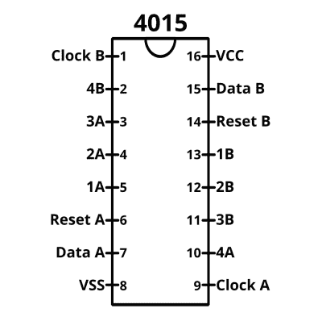
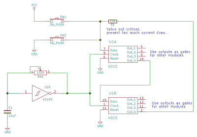
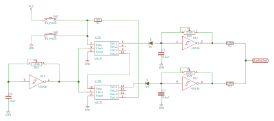
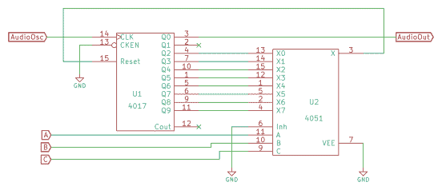
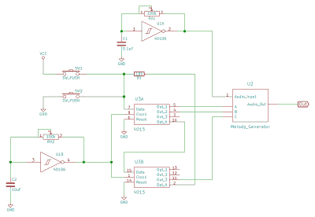
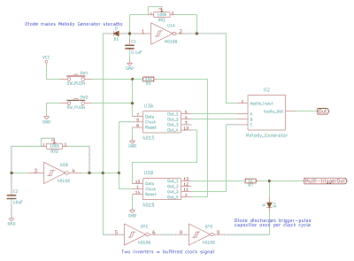

# 逻辑噪声:驯服野生移位寄存器

> 原文：<https://hackaday.com/2015/05/04/logic-noise-taming-the-wild-shift-register/>

DIY synth 构建的最大好处之一是，你可以创建商业市场上不存在的设备。在这节课中，我们将制作一个你可能从未见过的循环/序列器。太棒了。今天，我们还将更接近这个系列的精髓。在本节课中，没有什么是模拟的，这是纯粹的逻辑噪声。

移位寄存器是本次会议的核心芯片，本身就是一个伟大的器件。我们有很多内容要介绍，所以请观看预告视频，然后开始吧。

[https://www.youtube.com/embed/_EJQO4cWgFM?version=3&rel=1&showsearch=0&showinfo=1&iv_load_policy=1&fs=1&hl=en-US&autohide=2&wmode=transparent](https://www.youtube.com/embed/_EJQO4cWgFM?version=3&rel=1&showsearch=0&showinfo=1&iv_load_policy=1&fs=1&hl=en-US&autohide=2&wmode=transparent)

## 4015 双移位寄存器

[移位寄存器](https://en.wikipedia.org/wiki/Shift_register)最常用作串并或并串转换器。也就是说，它们要么单独接受一堆比特，然后一次性全部输出，要么一次性接受一堆比特，然后一个接一个地吐出来。4015 是前一组的一员(有点隐晦)。

移位寄存器内部是一组一位存储单元，实现为[型 D 触发器](https://en.wikipedia.org/wiki/Flip-flop_%28electronics%29)。每个单元在接收到时钟信号时存储其输入值。它之所以成为移位寄存器，是因为单元排成一行，一个典型单元的输入连接到它前面单元的输出。当时钟脉冲时，第一个单元中的值被传输到第二个单元，第二个单元将其值传输到第三个单元，依此类推。

想象一个水桶队——一排人朝一个方向传递水桶。这里，桶是否满代表一种逻辑状态。例如，在将四个桶传递到行中之后，我们可以告诉每个人停下来看看他们桶中的内容。这是一个简单的 4 位串并移位寄存器。

4015 内部有两个完全独立的 4 位移位寄存器。市面上有许多不同的串行到并行移位寄存器芯片，每种芯片都有细微的差别，但事实上，一个芯片上有两个寄存器，这使得它成为逻辑噪声应用的绝佳选择。而且，我们很快就会看到，通过一点布线，您可以轻松地将其转换为一个 8 级寄存器。

要使用这个芯片，你需要连接电源和地线。拉低“复位”线以启用寄存器。假设我们使用 A 寄存器。然后，在下一个正向时钟转换时，无论数据 A 输入端的逻辑电压是多少，都会移入并显示在 1A 输出端。1A 的价值转移到了 2A，等等。4A 的价值消失了。

这种芯片的一个警告是时钟线很挑剔——它需要漂亮干净的时钟转换。如果您试图用一个不可靠的信号为芯片计时，您可以[使用我们的带施密特触发器的 40106 反相器](http://hackaday.com/2015/02/04/logic-noise-sweet-sweet-oscillator-sounds/)来实现其实际预期目的(仅此一次),并通过一个反相器级传递信号，从几乎任何电压输入中获得一个漂亮干净的时钟。不过，这不是我们的问题，因为我们首先使用 40106 作为我们的时钟源。

另一个警告更适用，您将在整个演示视频中看到示例。4015 数据线和时钟线具有非常敏感的输入，喜欢拾取杂散信号。因此，当你拔掉电线时，你经常会听到疯狂的噪音，这是用你的电力线频率(欧洲 50Hz，美国 60Hz)驱动线路的产物。

解决方案是确保引脚上始终有一个确定的电压。如果要进行实时修补，只需为任何想要默认为低电平的引脚增加一个 100k 的接地电阻即可。大多数你连接的东西都能把线拉起来，但是当你让它摇摆的时候，它会回到地面。

## 作为模式发生器的移位寄存器

好吧，但是我们为什么在这里谈论移位寄存器？正如你有希望在预告视频中看到的那样:因为它们可以用作类似序列器的模式发生器和数字活套。(还有更多！)

[https://www.youtube.com/embed/nTc_AUWFvqA?version=3&rel=1&showsearch=0&showinfo=1&iv_load_policy=1&fs=1&hl=en-US&autohide=2&wmode=transparent](https://www.youtube.com/embed/nTc_AUWFvqA?version=3&rel=1&showsearch=0&showinfo=1&iv_load_policy=1&fs=1&hl=en-US&autohide=2&wmode=transparent)

首先，让我们钩住 4015 的一边，用它触发我们的鼓和钹电路。我们变得懒惰，只从钹电路中构建了三个振荡器，所以它有点像钹/小军鼓的混合体。我们要用“斯尼巴尔”。

移位寄存器的四个输出抽头中的任何一个都可以作为我们的鼓或鼓的栅极源。但我们将采取传统的路线，将低音连接到输出 1A，将音柱连接到 3A。(你可以用一个[二极管或](https://hackaday.com/wp-content/uploads/2015/04/diode_or-sch.png?w=400&h=215)将 3A 脉冲加倍到低音鼓，就像我们上节课做的那样，如果你真的想要四个在地板上跳舞的节拍。)

现在只差一个时钟和数据源了。带有 10uF 电容的 40106 振荡器是一个很好的时钟，在视频中，我们将另一个类似的振荡器放入数据线，并对两个时钟进行去调谐，以产生一些更长的节奏变化，这非常有趣。

电路就像上面描述的那么简单。摆弄它很值得你花时间。

现在，如果四位模式对你来说还不够，是时候连接芯片的另一半了。因为芯片有两个独立的移位寄存器，你可以简单地连接更多的时钟和数据振荡器。要得到听起来不错的东西，就要小心地调整时钟，使它们彼此同步。大多数人只是把时钟 A 复制到时钟 b。

如果你想创造疯狂的多节奏，你可以使用 4017 计数器的输出来提供第二个时钟源。将第一个寄存器的时钟复制到 4017 的输入，将复位线连接到所需的节奏划分，并使用任何方便的 4017 输出(比如 Q0，因为它总是脉冲)作为第二个时钟。

但就我们的目的而言，事情很快就会变得有趣起来。因此，经过一点试验，我们将采取最无聊的选择，将 4015 配置为一个单一的 8 位移位寄存器。为此，只需将两个时钟输入连接到同一个时钟源，并将输出 4A 连接到输入数据 b。这样，当一位通过寄存器 A 时，它会直接进入寄存器 b

再说一遍，这一切的逻辑非常简单。有趣的是移位寄存器产生一串彼此有节奏延迟的脉冲的方式。你只需要把它连接到一些声源上，玩一会儿，你就会明白我们的意思了。不要忘记改变输出抽头，看看它如何改变产生的模式。

在某些情况下，您会希望能够更好地控制寄存器中的模式转换，一种方法是自己接管数据输入，就像我们在视频中所做的那样。如上所述，这些芯片对杂散信号非常敏感，因此您需要将下拉或上拉电阻连接到数据线，以防止它们在按钮未被按下时呈现变量值。

[https://www.youtube.com/embed/0Esvs74fFo8?version=3&rel=1&showsearch=0&showinfo=1&iv_load_policy=1&fs=1&hl=en-US&autohide=2&wmode=transparent](https://www.youtube.com/embed/0Esvs74fFo8?version=3&rel=1&showsearch=0&showinfo=1&iv_load_policy=1&fs=1&hl=en-US&autohide=2&wmode=transparent)

在那之后不久，你会讨厌如此频繁地按下按钮。如果你能建立一个模式并让它简单地重复，那不是很好吗？相当于循环序列发生器的逻辑噪声，还是什么？那正是我们要去的地方。

## 作为活套的移位寄存器

通过移位寄存器进行模式循环非常简单。只需将最后一个(或任何一个)输出连接回输入数据引脚，形成一个数据反馈环路。对于八步，这是 4B 到数据 a。对于奇怪的节奏，你可以做任何你喜欢的事情。见鬼，你甚至可以通过 4051 开关芯片自动返回，并从外部选择步数。(伏笔！)

 一个循环没有任何乐趣，除非我们能在其中插入和移除脉冲。反过来说，一旦我们能做到这一点，那就太可笑了。简单地将按钮连接到数据反馈是不太管用的。例如，如果你试图在 4015 试图将其拉高时将数据线接地，你最终会从芯片中吸取太多的电流，从而导致故障。解决方法是在反馈回路中插入一个电阻，并连接数据端的按钮。

正如本次会议的所有例子一样，电路非常简单。我们已经放弃了旧的数据振荡器，通过一个中等大小的电阻(10k 应该很好)将输出 4B 连接到数据 A，并将按钮连接到地和 VCC。几乎没有痛苦，巨大的收获。

[https://www.youtube.com/embed/wtVugZte8Bw?version=3&rel=1&showsearch=0&showinfo=1&iv_load_policy=1&fs=1&hl=en-US&autohide=2&wmode=transparent](https://www.youtube.com/embed/wtVugZte8Bw?version=3&rel=1&showsearch=0&showinfo=1&iv_load_policy=1&fs=1&hl=en-US&autohide=2&wmode=transparent)

## 环形振荡器

如果您一直关注逻辑噪声，那么您已经在考虑如何使用这种移位寄存器循环序列器来驱动振荡器了。事实上，它太简单了，以至于我们在第一节课就做到了。我们用来创建同步振荡器的不起眼的二极管门电路就能做到这一点。

例如，当移位寄存器的第一个输出为低电平时，二极管 D1 拉低振荡器的定时电容(C1 ),防止它通过可变反馈电阻(RV1)充电。

我将振荡器的输出与 100k 电阻相加。如果您想让一个振荡器比其他振荡器更响，请随意更改这里的值。您可以随意使用任意数量的振荡器来制作音符或声音。

但请注意，它变得不和谐(或至少复音)相当快。移位寄存器序列器和“正常”序列器的区别在于，您可以将多个脉冲插入移位寄存器。对于每个脉冲，您将弹奏与连接的振荡器相对应的模式。即使只有少量的脉冲在循环，你也最好调整你的振荡器，让它们彼此协调，因为它们可能会在某个时候一起发出声音。

[https://www.youtube.com/embed/XLCgZiRbups?version=3&rel=1&showsearch=0&showinfo=1&iv_load_policy=1&fs=1&hl=en-US&autohide=2&wmode=transparent](https://www.youtube.com/embed/XLCgZiRbups?version=3&rel=1&showsearch=0&showinfo=1&iv_load_policy=1&fs=1&hl=en-US&autohide=2&wmode=transparent)

这种简单方法的另一个缺点是需要连接很多电线。如果您想要弹奏八个音符，您需要构建八个独立的同步振荡器。因此，让我们花一分钟来建立一个音高发生器，它可以很好地与我们的移位寄存器 looper 配合使用。

## 撇开旋律发生器不谈

据我所知，这个电路是电子音乐 Lunetta 论坛的人发明的，但我肯定它在某些方面更古老。它简单而出色，只用两个芯片就能创造出(大部分)和声相关的音高。很容易转移注意力。

[上节课](http://hackaday.com/2015/04/24/logic-noise-sequencing-in-silicon/)，我们使用 4017 计数器芯片构建了一个“正常”的序列发生器，它在每个周期的每个输出端输出一个脉冲，并且按顺序输出。我们还讨论过，可以通过将 Reset 引脚连接到计数器的一个输出来改变序列的长度，从而在第十拍之前重新开始计数。

在其核心，旋律发生器只是一个 4017 计数器运行在音频。如果我们使用音频信号作为 4017 的输入，复位线接地，我们会得到 1/10 的输入音高。通过将 reset 引脚连接到其他 4017 输出来改变计数，可以得到输入音高的其他划分。到目前为止，一切顺利。

接下来，我们使用一种更通用的芯片 4051 8 路开关来自动连接复位线。这意味着 4051 的三条选择线控制 4017 的哪个输出触发其自身的复位，因此选择线控制产生的分频输出间距。

    

电路相当简单，但是如果你想得到可预测的结果，你必须小心连接所有的线路；两个芯片上的引脚都是“随机”排列的。还要注意，我们跳过了前两个 4017 输出，使用第一个作为我们的输出。你想把 4017 的 Q2 和 4051 的 X0 连接起来等等。这里有一张备忘单可以帮助你。

你必须建造这条赛道。上节课的 4017 和前几节课的 4051。你没有借口。

[https://www.youtube.com/embed/WXR_SiyvLf8?version=3&rel=1&showsearch=0&showinfo=1&iv_load_policy=1&fs=1&hl=en-US&autohide=2&wmode=transparent](https://www.youtube.com/embed/WXR_SiyvLf8?version=3&rel=1&showsearch=0&showinfo=1&iv_load_policy=1&fs=1&hl=en-US&autohide=2&wmode=transparent)

## 旋律发生器

旋律发生器电路的美妙之处在于，你可以把它想象成一个黑匣子。输入一个音频速率逻辑波形和一个三位二进制信号，就可以得到相应的分频音高。我们现在可以在睡眠中构建振荡器了，但是剩下的三个逻辑信号呢？

如果你喜欢完全的混乱，你可以把节奏时钟信号输入到三个 4051 输入端。振荡器的相对速度会根据振荡器彼此接近整数倍的程度，形成随时间变化的模式。很难控制，但在这个词的良好意义上是一个怪胎。

 如果你喜欢完整订单，回想一下[我们最初驾驶 4051 的方式，用 4040](http://hackaday.com/2015/02/23/logic-noise-the-switching-sequencer/) 二进制计数器。只需用一个速度振荡器为 4040 计时，你就可以完成旋律发生器产生的所有八个音符。按错误的顺序连接水龙头会产生有趣的图案。

在混乱和秩序之间的甜蜜点的某个地方，是本次会议的杰作电路:旋律发生器回路。你所要做的就是将三个旋律发生器逻辑输入连接到三个不同的循环输出抽头。

现在准备好花一个小时或更多的时间来探索这条电路将会做什么。从循环中添加和移除脉冲，四处移动拍子，并试验它如何与我们已经内置的打击乐器元素互动。

[https://www.youtube.com/embed/wPxcysxJ9Zk?version=3&rel=1&showsearch=0&showinfo=1&iv_load_policy=1&fs=1&hl=en-US&autohide=2&wmode=transparent](https://www.youtube.com/embed/wPxcysxJ9Zk?version=3&rel=1&showsearch=0&showinfo=1&iv_load_policy=1&fs=1&hl=en-US&autohide=2&wmode=transparent)

事实上，让这条电路令人奇怪地满意的是，它位于可控性和混沌的边缘。当您将脉冲引入循环时，它会改变旋律发生器音符的音高，但它会改变您作为打击乐附加的任何东西的节奏。只有通过手动重新布线来改变抽头，才能改变旋律的节奏。流通中的一个额外脉冲改变了许多音符。然而，不知何故，这一切似乎在音乐上结合在一起。

## 旋律发生器 Looper Royale 奶酪

你想配薯条吗？我们如何调整这条线路，让它发挥更大的作用？很高兴你问了。这里有两个简单的调整会带来真正的不同。

第一个调整是让旋律发生器播放断奏音符，而不是让每个音符进入下一个音符。老实说，这是老一套的门控振荡器把戏。只需将一个二极管连接到音频振荡器的电容器上，然后将另一端连接到循环装置的速度时钟上。

现在你可能已经注意到，如果你在这个电路中使用类似 Twin-T 低音鼓的东西，它不会随着每个新脉冲重新触发。也就是说，如果你有三个连续的脉冲，低音触发一次，然后直到有一个间隙后才再次触发。这是构建栅极到触发脉冲电路的方式的副作用。我们可以解决这个问题。

单触发行为的原因是，我们使用一个电容将方波脉冲的上升沿变成一个短尖峰。如果电容器的线圈端在下一个脉冲信号之前不能放电，它就不会产生尖峰信号，鼓也不会再发出声音。

解决方法与断奏的修改是一样的；使用速度时钟振荡器在脉冲中间拉下电容器。但是在上次[会议](http://hackaday.com/2015/04/24/logic-noise-sequencing-in-silicon/)的钹或低音鼓接口电路的情况下，它们汲取了大量的电流，可能足以淹没时钟振荡器。因此，完整的解决方案是在 40106 上用另一个级缓冲时钟电路，但实际上你需要两个级，因为你想要的是时钟的实际副本，而不是极性相反的副本(尽管反相版本产生了一个不错的额外节拍，这是在制作视频时误发现的)。

[https://www.youtube.com/embed/8eYU1_qxj4g?version=3&rel=1&showsearch=0&showinfo=1&iv_load_policy=1&fs=1&hl=en-US&autohide=2&wmode=transparent](https://www.youtube.com/embed/8eYU1_qxj4g?version=3&rel=1&showsearch=0&showinfo=1&iv_load_policy=1&fs=1&hl=en-US&autohide=2&wmode=transparent)

## 扩展ˌ扩张

这个回路有太多的事情要做。首先，您可能想要在旋律发生器不播放任何音符的地方插入暂停。我们将 4017 的抑制线接地，但如果用下拉电阻将其拉低，则可以通过向其发送逻辑高电压来抑制旋律发生器。如何排序对读者来说是一个挑战。另一方面，用音频振荡器驱动它，会产生类似于我们的 XOR 电路的东西。

当然，你可以把两个 4015 链在一起，做成一个 16 步的活套。或者更多，如果你有试验板空间的话。另一方面，还有其他具有更长序列的移位寄存器芯片。只要确保你得到一个有足够的并行输出是有用的。例如，4031 有一个 64 步的移位寄存器，但只有最后一步是暴露的(也就是说，你可以用那个芯片制作一个[可怕的一位 looper](http://www.tinydazzler.blogspot.de/2012/09/tap-loop-tap-loop-4031-tap-looper.html) )。如果你能找到的话，像现在已经停产的 4006 这样奇怪的东西会很有趣。4094 有八个阶段，还有一些不错的额外功能。

最后，您可以添加一个 4070 XOR，并制作一个[线性反馈移位寄存器(LFSR)](https://en.wikipedia.org/wiki/Linear_feedback_shift_register) ，它通常被用作快速而肮脏的伪随机数生成器。要使用我们的设置制作最大长度的 LFSR，请通过级联 xor 将抽头 4A、1B、3B 和 4B 连接回数据 A。LFSRs 在音乐上并不那么有用，以至于我们要把它们写出来，但它们仍然很酷。为你的 LFSR 选择非标准拍子会产生周期更短的循环，虽然，这对于随机数来说是不好的，但是对于音乐应用来说明显更好。

或者将一个 4 步移位寄存器用于旋律发生器，另一个用于[选择八度琶音的 4040 二进制分频器](http://electro-music.com/forum/topic-64356.html)的抽头。这是另一个层次的复杂，但它是可怕的。你会在 YouTube 上找到两个深夜视频[在这里](https://www.youtube.com/watch?v=zPJkK4H0dRg)和[在这里](https://www.youtube.com/watch?v=A91VUSMdRVw)。

## 下一次会议

无论如何，我们都没有结束逻辑噪声，但随着本次会议的结束，我们已经用数字逻辑芯片(及其滥用来创建模拟波形)完成了一系列技巧，这将给你足够多的绳子来吊死你自己和你的一些邻居。如果这是一门大学课程，我们已经学完了逻辑噪音 101。

下节课，我们将总结一下目前为止的进展，并开始思考如何构建分立电路以及如何将它们互连起来。我们需要一份材料清单(或购物清单？)系列，这在现在是有意义的，因为是时候为自己构建一个独立的逻辑噪声合成器了。

我们还将包括各种文献综述——进一步阅读的链接，项目，以及建立在我们目前所做的基础上的方向。简而言之，处理好一路上出现的所有问题。

但是，逻辑噪声 101 的结束也意味着我们将很快开始处理逻辑噪声 102。中心话题将是我们到目前为止刻意回避的:电压控制。敬请关注全新的一罐蠕虫。