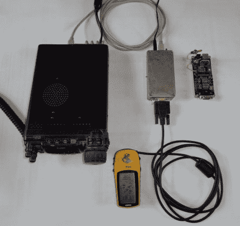

# 使用 FreeTrak63 进行长距离高频 APRS 跟踪

> 原文：<https://hackaday.com/2013/11/14/long-distance-high-frequency-aprs-tracking-using-the-freetrak63/>

如果你对业余无线电爱好有所涉猎，我们肯定你听说过 GPS 位置监测或跟踪，它使用 APRS 分组数据，通常通过 VHF 业余波段和 FM 调制传输。使用这种常用方法时，你将面临的一个问题是 VHF 的范围限制。[Mike Berg]又名[N0QBH ]向我们透露了他的最新项目，该项目利用单边带(SSB) 上的高频波段，大大增加了[独立 APRS 系统的范围。](http://www.ringolake.com/pic_proj/FT63/ft63_page.html)

在 HF 波段上使用单边带传输分组数据存在一些独特的挑战。高频 APRS 利用 300 波特的 FSK AX.25 分组传输已经存在几十年了，但是它非常容易受到噪声和传播偏差的影响。最近，PSK-31 在较慢的 31 波特速度有助于缓解这些问题。[迈克]利用稍微更新的 [APRS 与 PSK-63](http://wa8lmf.net/APRS_PSK63/index.htm) 和“ [APRS 信使](http://www.crosscountrywireless.net/aprs_messenger.htm)计划来克服这些挑战。[Mike 的]硬件解决方案由 PIC 16F690 微处理器组成，该处理器经过编码，可接收来自 GPS 接收器的数据，将其转换为 PSK-63，然后通过连接的高频无线电传输到 30 米以外的地方。第二个接收站或远距离的接收站可以使用“APRS 信使”程序接收和解码传输，该程序通过计算机的声卡连接到接收无线电。如果追踪信息是正确的，该程序可以将追踪信息转发给 FindU.com 的[和 APRS 的](http://findu.com/)[等追踪网站。FI](http://aprs.fi) 。

您可以通过下载[Mike's]零件清单、装配代码、十六进制文件、手册和原理图来构建自己的 FreeTrak63。如果你不想自己制作或者点对点布线，可以在 OSH Park 买到 [PCB。让我们不要忘记提及这种硬件是如何可攻击的，它实际上只是一个 8 位 DAC、微型、串行输入和无线电输出。人们可以对这种硬件重新编程，以实现其他调制方案，如 AX.25 packet 或 MFSK16，前途无量。如果使用 Arduino 兼容平台的现有互联网连接接收器网络的 VHF 短距离更符合您的口味，那么请检查](http://oshpark.com/shared_projects/13YLnBaP) [Trackuino 开源 APRS 跟踪器](http://hackaday.com/2011/04/20/trackuino-%E2%80%93-an-open-source-arduino-aprs-tracker/)。