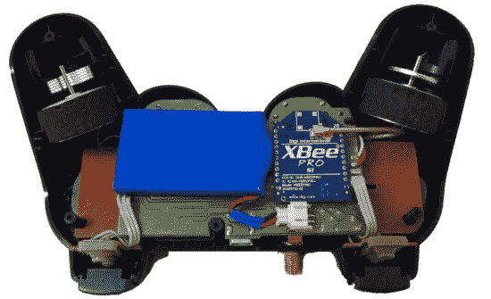

# 长距离 PS3 控制器

> 原文：<https://hackaday.com/2013/06/19/long-distance-ps3-controller/>

索尼的 DualShock 3 控制器可以在 Hackaday 的许多项目中看到。这是有原因的:很容易嗅出这个控制器发出的蓝牙信号，让任何电子项目做你的遥控投标。不过，蓝牙的范围相当有限，如果你想在一英里左右的范围内使用这个非常舒适、非常实用的控制器，会发生什么情况呢？只需[使用 Xbee 无线电将控制器](http://proofofprinciple.nl/index.php/ps3-rc)的主板换成新设计。这是一个来自[Marcel]工作台的伟大项目，看起来只是一个令人敬畏的 Xbee 遥控器的解决方案。

索尼 DualShock 3 控制器围绕一个主板设计，用于大部分电子设备和模拟棒，三个子板用于控制器上的每隔一个按钮。[Marcel]从他的控制器中取出主板，并声明对该东西进行逆向工程，保留 USB 充电、PC 通信、力反馈和 LED 指示灯。与原始电路中的蓝牙不同，[Marcel]使用了一个 60mW 的 XBee 无线电，这使他可以控制连接到另一个 XBee 无线电的任何东西，范围可达一英里。

[Marcel]的新主板是对原有 DualShock 3 主板的直接替换，对控制器的唯一修改是钻了一个小孔，用于新天线。这是一个很好的任何类型的遥控车辆套件，它完全可编程为任何机器人项目，你可能有想法。

感谢{ Roel }发送此邮件。