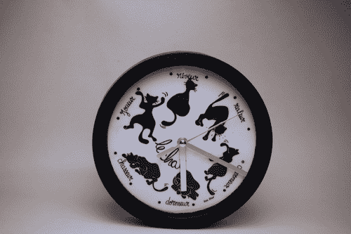

# 维蒂纳里勋爵的钟又敲响了

> 原文：<https://hackaday.com/2013/02/12/lord-vetinaris-clock-strikes-again/>

受《Discworld》中令人抓狂的时钟的启发，这款时钟可以保持时间，但任何看着秒滴答流逝的人可能会因此精神不稳定。【雷诺·施莱克】[用很少的元件建造了口吃的时钟](http://renaud.schleck.free.fr/horloge_vetinari.php)。他在受到[的启发后着手建造【西蒙旅馆】建造的版本](http://hackaday.com/2011/10/12/building-a-better-clock-to-drive-you-insane/)。

时钟本身是一个使用一节电池计时的普通物品。我们总是对这些非常便宜的东西如何在长时间内保持如此准确印象深刻——但我们跑题了。攻击的方法是用线圈注射来驱动手。[Renaud]使用 MSP430 Launchpad 中的一个微控制器，以及套件附带的时钟晶体，来控制该机制。水晶触发了一个中断，这个中断实际上是计时的。秒针是根据他在文章中解释的算法偶尔驱动的。

休息后可以看视频里不均匀的滴答声。尽管该功能在视觉上令人不安，但短刻度和长刻度相互平衡，正确的时间继续显示。

[https://www.youtube.com/embed/rijmudoj39w?version=3&rel=1&showsearch=0&showinfo=1&iv_load_policy=1&fs=1&hl=en-US&autohide=2&wmode=transparent](https://www.youtube.com/embed/rijmudoj39w?version=3&rel=1&showsearch=0&showinfo=1&iv_load_policy=1&fs=1&hl=en-US&autohide=2&wmode=transparent)

[via [Reddit](http://www.reddit.com/r/electronics/comments/18bgjm/this_clock_is_supposed_to_turn_your_brain_into_a/)