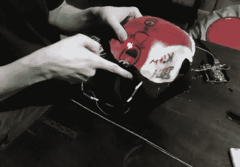

# 清醒梦面膜将经济与舒适结合

> 原文：<https://hackaday.com/2012/06/18/lucid-dreaming-mask-marries-economy-with-comfort/>

这里有一个努力去做一个便宜又舒适的清醒梦面具。这个想法是为了回应[我们在 4 月份看到的护目镜](http://hackaday.com/2012/04/19/do-anything-with-the-help-of-lucid-dreaming-goggles/)(戴着它睡觉不会太舒服)和[大获成功的 Remee](http://www.kickstarter.com/projects/bitbangerlabs/remee-the-rem-enhancing-lucid-dreaming-mask) (目标价格为 80 美元)。

面具本身是用儿童的羊毛毯子缝制的。里面是一块从娱乐垫上切下来的泡沫。你知道，那些方块是用来做游戏区的，像拼图一样连在一起。你可能已经在上面的图像中发现了 Arduino，但该项目旨在通过嵌入泡沫中的 AVR 芯片运行。该设计仅使用三个 led，对你来说可能有用，也可能没用——我们猜测这取决于它们如何与你的眼睛对齐。休息后的视频很好地说明了建设中的每一点。

如果你在寻找一些不那么舒缓、更具娱乐性的东西，你总是可以试试这些迷幻护目镜。

[https://www.youtube.com/embed/bjhaS1avzeU?version=3&rel=1&showsearch=0&showinfo=1&iv_load_policy=1&fs=1&hl=en-US&autohide=2&wmode=transparent](https://www.youtube.com/embed/bjhaS1avzeU?version=3&rel=1&showsearch=0&showinfo=1&iv_load_policy=1&fs=1&hl=en-US&autohide=2&wmode=transparent)