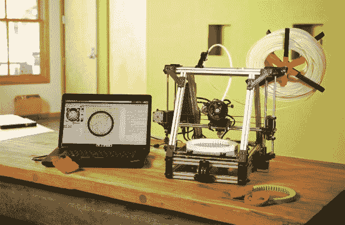

# LulzBot 正在分发更多的打印机

> 原文：<https://hackaday.com/2013/03/22/lulzbot-is-giving-away-more-printers/>

LulzBot 是一家名副其实的 3D 打印机制造商和零件供应商，[将向八个幸运的黑客空间赠送八台 AO-100 打印机。](https://www.lulzbot.com/?q=news/printer-giveaway)

这与其说是一场竞赛，不如说是一场针对八个社区运营的黑客空间的赠品，他们想出了一个如何使用 3D 打印机的好主意。如果你是尚未拥有 3D 打印机的知名黑客空间的一员，这是一个获得一台非常好的打印机的好机会。

不久前，[我们收购了一台 LulzBot 打印机](http://hackaday.com/2013/02/09/adventures-in-3d-printing-our-first-week-with-the-lulzbot-ao-100/)，为身体残疾的游戏玩家打印一些定制的游戏控制器(同时也制作一些其他很酷的东西)。我们的老板 man [Caleb]说 AO-100 是一款出色的打印机，在我与 LulzBot 的交易和采购中，他们看起来像是一家拥有强大支持的伟大公司。我们确信，赢得 LulzBot 赠送的这些打印机的黑客空间将能够通过制作一些非常酷的东西来迅速投入使用。