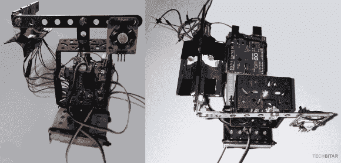

# LuxBlaster:向最强的光源发射一束光

> 原文：<https://hackaday.com/2014/02/24/luxblaster-blast-a-beam-of-light-at-the-most-intense-light-source/>

[Hazim]写信告诉我们他的项目是给不顾他人的司机一个教训！理论上来说。 [LuxBlaster](http://www.techbitar.com/luxblaster.html) 是指向最强光源的聚光灯。

这个想法是，你可以用你自己的反向远光灯来轰击那些不关闭远光灯的司机。**非常重要的一点是，千万不要使用**，因为【Hazim】也明确指出。虽然这个项目旨在证明它可以做到(一个“如果”项目)，但它有两个组件做得非常好，可以很容易地用于不同的项目:Arduino 控制的聚光灯和光强跟踪器。

你会用 Arduino 控制的聚光灯做什么？[智能照明](http://hackaday.com/2014/02/01/autonomous-lighting-with-intelligence/)？光源追踪器怎么样？请在评论中告诉我们。

[https://www.youtube.com/embed/7W4cFCtK4fw?version=3&rel=1&showsearch=0&showinfo=1&iv_load_policy=1&fs=1&hl=en-US&autohide=2&wmode=transparent](https://www.youtube.com/embed/7W4cFCtK4fw?version=3&rel=1&showsearch=0&showinfo=1&iv_load_policy=1&fs=1&hl=en-US&autohide=2&wmode=transparent)