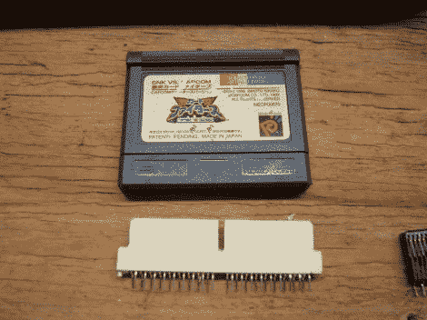

# 从 PCI 插座加工盒式连接器

> 原文：<https://hackaday.com/2012/06/20/machining-cartridge-connectors-from-pci-sockets/>

[Ed]需要一堆视频游戏卡带的边缘连接器。他无法为 Neo Geo 口袋游戏采购零件，最终[用 PCI 插座](http://www.flashmasta.com/2012/06/19/how-to-make-a-videogame-cartridge-connector-for-neo-geo-pocket-or-gameboy-nes-snes-genesis-etc/)自己组装。但听起来这种技术也适用于其他控制台盒式磁带。

从图中可以看出，这不仅仅是将一个墨盒插入插座那么简单。因为有多个步骤，并且需要许多连接器，所以[Ed 的]爸爸帮忙做了一些夹具来帮助切割。第一步是切断钥匙和插座的窄端。这些 NGP 墨盒是单面的，所以插座被切成两半，用一块有护墙板的木板作为夹具。在拔出两个中心销并切割出一个凹槽来接收盒式钥匙之前，可以从那里清理掉塑料块。还有两个肩部切口需要在裁成一定长度后进行。休息后的视频将带你了解整个过程。

这些 PCI 插座是通用的。我们另一个最喜欢的黑客[用它们来制作 SOIC 编程剪辑](http://hackaday.com/2010/11/18/build-your-own-soic-progamming-clip/)。

[https://www.youtube.com/embed/yscymOgb-vM?version=3&rel=1&showsearch=0&showinfo=1&iv_load_policy=1&fs=1&hl=en-US&autohide=2&wmode=transparent](https://www.youtube.com/embed/yscymOgb-vM?version=3&rel=1&showsearch=0&showinfo=1&iv_load_policy=1&fs=1&hl=en-US&autohide=2&wmode=transparent)