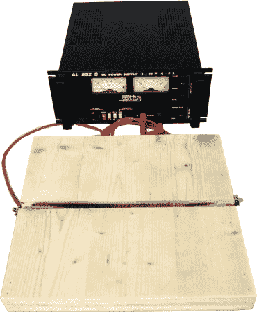

# 用你已经有的材料做一个塑料弯曲器

> 原文：<https://hackaday.com/2014/03/06/make-a-plastic-bender-using-stuff-you-already-have/>

[2PrintBeta]的团队发现他们的 3D 打印机 Printupy 需要一些独特的塑料型材。由于找不到他们所需要的供应商，他们决定尝试使用现有的材料建造自己的[廉价折弯站](http://ifeelbeta.de/index.php/31-general/general/167-simple-bending-station-for-plastics)。

不太关心系统的寿命(或者易燃性？)他们拿了一块木板，在木板的中心划出一条直槽。使用电源和一些镍铬合金线——就完成了。

他们承认这真的不是最耐用的，而且万一着火也需要不断的监督——但是它的制作成本几乎为零，而且实际上效果很好！我们喜欢下面的视频是因为他们也向我们展示了设计过程，激光切割和弯曲来创造最终产品。

[https://www.youtube.com/embed/Paw-bpG1rxA?version=3&rel=1&showsearch=0&showinfo=1&iv_load_policy=1&fs=1&hl=en-US&autohide=2&wmode=transparent](https://www.youtube.com/embed/Paw-bpG1rxA?version=3&rel=1&showsearch=0&showinfo=1&iv_load_policy=1&fs=1&hl=en-US&autohide=2&wmode=transparent)

升级这个单元的一个简单方法是在凹槽中增加一个金属 U 型槽以减少火灾隐患——就像我们去年精选的这个 [亚克力弯曲器](http://hackaday.com/2013/02/28/bending-materials-with-a-simple-hot-wire-forming-tool/) ！