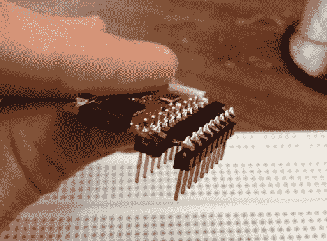

# 将双引脚接头封装到试验板友好 DIP 中

> 原文：<https://hackaday.com/2012/11/13/make-dual-pin-header-footprints-into-breadboard-friendly-dip/>

[John]写了一篇文章，提出了困扰我们很长时间的原型问题的解决方案。上面你可以看到[他提出的双排引脚接头的 DIP 友好解决方案](http://jdonnal.scripts.mit.edu/home/?p=111)。只需一点简单的焊接，他现在就有了一个用于原型制作的试验板友好设备。

他首先在电路板上焊接一个双排引脚接头，然后剪掉外侧一排的所有引脚。然后将剩下的那排腿插入他的试验板上沟槽的一侧。沟槽的另一侧有一个单排引脚接头，他使用另一个水平对齐的单排引脚接头将它们焊接到分线板上的外排。这不是一个 100%方便的解决方案，因为仍然很难在分线板覆盖的一侧将跳线插入试验板。但是，如果您提前计划，您可以先放置电线，然后插入开发板。

这里[John]正在使用 TI 的 eZ430-RF2500 板。我们想要返回并移除我们焊接在 eZ430-F2013 上的双引脚插座，用这种类型的引脚替换它。