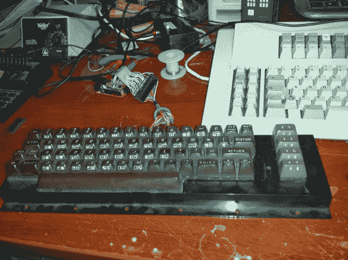

# 使 C64 键盘像 USB 键盘一样工作

> 原文：<https://hackaday.com/2014/07/17/make-that-c64-keyboard-work-as-a-usb-keyboard/>

面对现实吧，我们都有键盘怪癖。不要试图否认，每个经常打字的人都对他们频繁敲击的键盘有看法。我们知道[Brian Benchoff]非常信任他的 M 型，我们猜测是他偶遇[Evan]并说服他写下他将 Commodore 64 键盘转换成 USB 设备的经历。

这不是[埃文]的第一次竞技。我们最近看到他在修理他自己的 M 型车上磨破的字母。但是这一次有一些聪明的微控制器在起作用。显然，使用 Atmel AVR 32u4 芯片(内置 USB 连接)映射 122 个键是一项相当艰巨的任务。幸运的是，有人已经想出了各种好办法，并与[分享了飞人的键盘控制器固件](http://geekhack.org/index.php?topic=50437.0)。当然，它处理扫描，但也包括去抖，多路复用，以及扫描比 uC 引脚更多的按键的技巧。我们仍然没有完全理解这一点。但是[Evan]确实发布了他正在使用的配置文件，所以也许在我们深入研究代码之后，我们会有更好的理解。

如果你尝试一下，我们想听听。谁有喜欢的现代键盘？请在下方留言评论。