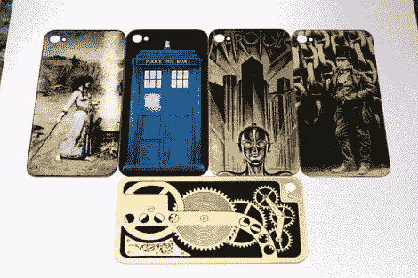

# 制作你自己定制的 IPhone 后玻璃

> 原文：<https://hackaday.com/2012/07/26/make-your-own-custom-iphone-back-glass/>

[杰克·冯·斯莱特]又来了；把他自己的艺术旋转放在普通的物品上。这次是 iPhone 背面的玻璃。它一直在破裂，更换了几次后，他想用一块蚀刻过的黄铜来代替玻璃。但是在实验进行到一半的时候，他发现了如何使用墨粉转移来开发这些令人惊叹的定制 iPhone 玻璃背板。

第一步是为您的手机找到正确的替代品。这些由两部分组成，玻璃和一个塑料衬垫。通过小心地加热并用一些冰棒棍楔住这两部分，他能够将碎片分开。接下来，他清洁并擦亮玻璃，为他将要应用的艺术品做准备。墨粉转印纸，就像用于 PCB 抗蚀剂一样，用于印刷和粘附设计到玻璃的下侧。在那里，他用手在黑色轮廓上绘画，以达到上面看到的效果。

这需要时间和耐心，但应该不比蚀刻电路板难。