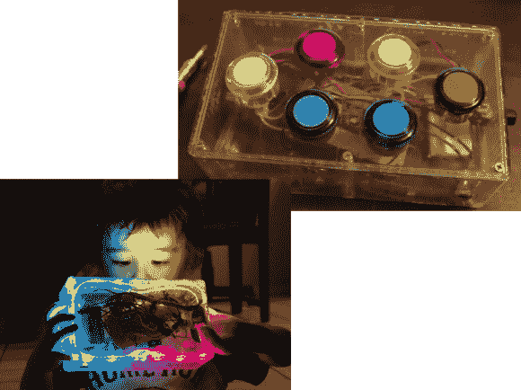

# 制作自己的电子儿童玩具

> 原文：<https://hackaday.com/2013/07/17/make-your-own-electronic-childrens-toys/>

[米里雅·格鲁尼克的]儿子侄子两岁了。如果你曾经在玩具货架上看到过这个年龄段的人，我们肯定你已经注意到有一大堆便宜的电子产品出售。如今，制造商们正在把发光二极管和噪音制造器塞进几乎所有的儿童用品中。但是[米里雅]想为什么不自己给他做点什么呢？她称这个[为闪光盒子](http://blog.grunick.com/blinky-box/)。这是一个丙烯酸外壳，里面塞满了漂亮的发光二极管，由几个按钮控制。

它由一块小小的电路板驱动，电路板上有六个彩色按钮、一个模式选择器和一个开/关开关。该设备由锂电池供电，可通过 USB 充电。当然，里面还有一条可单独寻址的 RGB LEDs。

演示显示，一种模式允许您按下一个按钮的颜色，并让 led 改变到它。但还有其他功能，如淡化和滚动。她还提到，因为它可以重新编程，玩具可以与他一起成长。也许会是一个西蒙说游戏。但最终她希望他会用它来学习编程的基础知识。

[https://www.youtube.com/embed/IFEwDlkCvh0?version=3&rel=1&showsearch=0&showinfo=1&iv_load_policy=1&fs=1&hl=en-US&autohide=2&wmode=transparent](https://www.youtube.com/embed/IFEwDlkCvh0?version=3&rel=1&showsearch=0&showinfo=1&iv_load_policy=1&fs=1&hl=en-US&autohide=2&wmode=transparent)