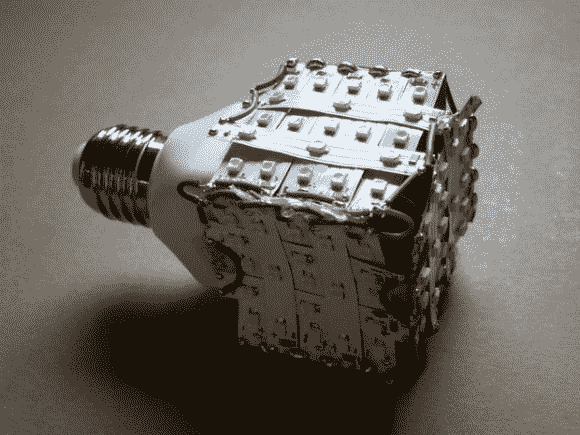

# 制作你自己的 LED 灯泡！

> 原文：<https://hackaday.com/2013/11/03/make-your-own-led-lightbulb/>

你喜欢省电吗？谁没有！

你周围有很多 LED 灯带吗？这些灯带是为一个你从来没有抽出时间去做的项目准备的？我们有罪！

你有旧的 DC 电源适配器吗？你当然知道。

你喜欢焊接吗？咄。

你身边有一个坏了的荧光灯泡吗？也许…

如果是这样，这里有一个简单快速的指南，教你如何 [制作自己的 LED 灯泡！](http://www.instructables.com/id/DIY-LED-LIGHT-BULB/)我们承认，这个结果有点简陋，但很实用。也许可以通过增加一个玻璃圣诞球来改善它，使它看起来更像一个普通的灯泡。如果你足够雄心勃勃，你可以在里面放一个微处理器，还可以添加无线控制……但老实说，智能 LED 灯泡现在越来越便宜了。但是，嘿，你得做些娱乐的事情！