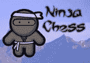

# 制作自己的忍者棋盘

> 原文：<https://hackaday.com/2015/07/25/make-your-own-ninja-chess-board/>

你会想看看这个有趣的项目[Alistair MacDonald]刚刚完成。他称之为[忍者象棋。](https://hackaday.io/project/6809-ninja-chess)

他想 3D 打印出一整套忍者对海盗的棋盘，但是，让我们现实一点；印刷 32 个棋子需要很长时间。他选择用激光切割机代替，到目前为止，只画了忍者的角色。但它仍然是一个非常棒的棋盘。

他画了 Inkscape 中的角色，他们非常可爱。他的指令器上有所有可用的文件，包括。DXF 用于激光切割轮廓，图像文件用于打印贴花。但是，除非你擅长剪刀，否则我们建议你使用 hackerspace 的自动切纸机来加快速度。

是黑客吗？不完全是，但是它会是任何人的工作室的一个极好的附加物。当我们在快乐扳手下航行时，我们也可以欣赏忍者棋盘的新奇。

关于更详细的构建，你看到我们几周前分享的 [3D 激光切割棋子](http://hackaday.com/2015/06/14/3d-miniature-chess-pieces-made-with-a-laser-cutter/)了吗？不，这不是打字错误——你可以用激光切割机做不仅仅是二维切割…