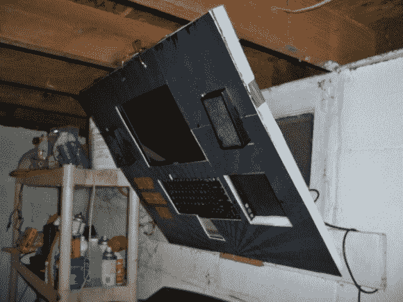

# 只需 0 美元，让您的跑步机更具娱乐性

> 原文：<https://hackaday.com/2013/09/07/make-your-treadmill-more-entertaining-for-0/>

有人放弃了他们的跑步计划，发现跑步机占用了他们地下室太多的空间，之后，跑步机就经常出现在路边。这对黑客来说太棒了，因为他们有一些有用的部分。

然而，如果你真的想用跑步机跑步，一些娱乐活动肯定会有帮助。[KingJackOff]决定用他手头的东西推出自己的[跑步机娱乐系统](http://imgur.com/a/pWLIb "Treadmill Entertainment System")，使总成本达到 0 美元。

他拿了一台旧笔记本电脑，用大量的胶带把它固定在一块硬质泡沫上。安装好屏幕和键盘后，他添加了扬声器和 DVD 驱动器插槽。然后，一个印刷图形被贴在前面，带有一个很好的激励信息。

许多人都有因机械故障而闲置的旧笔记本电脑。损坏的铰链和框架使它们无法使用，即使电子设备很好。一些泡沫和纸可能是你所需要的一切，让一个人起死回生。

[via [Reddit](http://www.reddit.com/r/pics/comments/1lv7uo/0_homemade_treadmill_entertainment_setup/)