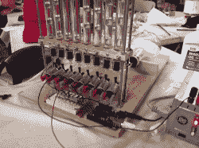

# MakerFaire K.C .堪萨斯城黑客空间提供

> 原文：<https://hackaday.com/2012/06/26/makerfaire-k-c-kansas-city-hackerspace-delivers/>

[https://www.youtube.com/embed/0ZQXtLjPHsM?version=3&rel=1&showsearch=0&showinfo=1&iv_load_policy=1&fs=1&hl=en-US&autohide=2&wmode=transparent](https://www.youtube.com/embed/0ZQXtLjPHsM?version=3&rel=1&showsearch=0&showinfo=1&iv_load_policy=1&fs=1&hl=en-US&autohide=2&wmode=transparent)
[堪萨斯城哈默空间](http://www.hammerspacehobby.com/)的人群今年带来了数量惊人的东西。有些东西你已经看过了，有些东西是全新的。我将单独分享其中一些的细节，因为它们确实值得关注。他们的展位很大，大约占了主厅的 1/3。它挤满了过多的个人项目，真的是无处不在。到处都有热情的人乐于炫耀他们建造的东西。他们的出现真的将 MakerFaire 的水平提升到了平流层。

他们不仅给 MakerFaire 带来了大量的令人敬畏的东西，而且还亲切地邀请人们在展览结束后回到 hackerspace 参加派对。他们在我的整个家庭里塞满了食物，让我们有宾至如归的感觉。看到大家聚在一起讨论各种项目真的很酷。ArcAttack 的工作人员甚至在排除一个工作不正常的小型特斯拉线圈。

休息之后，观看 Hackerspace 之旅并查看一些图片。强调一些个别项目的帖子将很快发布。

[https://www.youtube.com/embed/OBtyp1fUXN0?version=3&rel=1&showsearch=0&showinfo=1&iv_load_policy=1&fs=1&hl=en-US&autohide=2&wmode=transparent](https://www.youtube.com/embed/OBtyp1fUXN0?version=3&rel=1&showsearch=0&showinfo=1&iv_load_policy=1&fs=1&hl=en-US&autohide=2&wmode=transparent)

这里有一个简短的列表，列出了那里代表的内容:

*   三维扫描设备
*   黑客攻击的 ASCII 打字机——视频采访和细节即将发布
*   拍打着黄蜂的翅膀——视频采访和细节即将发布
*   丢失塑料印刷
*   布景模型
*   “量子封装器”
*   铁锈电解
*   神经元焊接套件
*   动画道具
*   空气炮
*   2 辆动力轮赛车
*   相扑机器人
*   人形机器人
*   仓鼠机器人
*   激光切割数控路由器
*   气泡展示—视频采访和详细信息即将发布
*   雕刻
*   一种公路电动车辆
*   各种丝印衬衫

