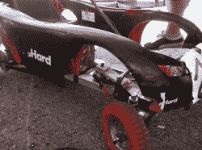
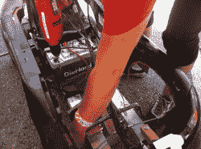
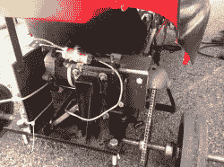
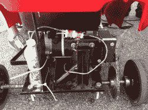
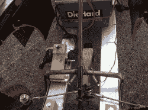
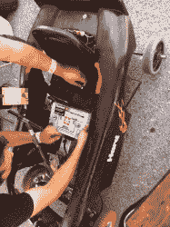
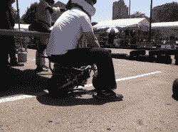
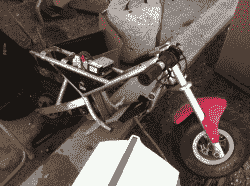
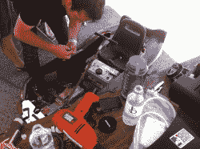

# MakerFaire K.C .:动力轮赛车

> 原文：<https://hackaday.com/2012/07/04/makerfaire-k-c-power-wheels-racing/>

[https://player.vimeo.com/video/44644726](https://player.vimeo.com/video/44644726)

MakerFaire 的这一部分几乎值得举办一个完整的活动。我知道我会很乐意在我的家乡参加每月一次的赛车系列赛。为了竞争，你必须有一个改良的动力轮。是的，那些电动童车在你的草坪上缓慢行驶，那些动力轮。你把它拆开，灌上汤，然后比赛。

我看到的改装都很棒。从电钻到启动马达，有完全不同的传动系统。车轮也经常被更换以获得更好的牵引力，尽管有些人选择保持较差的牵引力只是为了效果。控制系统的范围从处理电力的微控制器到两根混在一起的裸线。太棒了。

虽然从技术上来说这是一场比赛，但我觉得大多数参与者并不是为了获胜，而是为了创造一场有趣的表演。傻乎乎的服装和光滑的轮胎混合着水枪和欢乐的叫喊声，使得整个事情相当壮观。正如你所想象的，也有电气火灾，但每个人都立即跳了进去，采取了一系列经过练习的行动，以确保司机和旁观者不受伤害。这太棒了。我可能要开始寻找那些想在密苏里州斯普林菲尔德成立一个联盟的人了。

请注意，我能够最接近的黑色汽车有一个启动马达的动力。这台电机一直过热，所以他安装了一个水冷系统，你可以在照片中看到。太棒了。