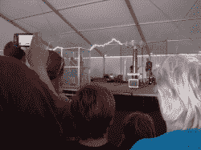
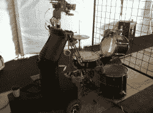

# MakerFaire K.C .在 ArcAttack 的新玩具上偷偷摸摸

> 原文：<https://hackaday.com/2012/06/25/makerfaire-k-c-sneak-peak-at-arcattacks-new-toy/>

几年来，我一直在网上看到关于 [ArcAttack](http://www.arcattack.com/) 的视频，希望有一天我能和他们相遇。当我听说他们要去 K. C .的时候，我决定抓住他们问几个问题。事实证明，他们是 Hackaday 的粉丝，并且乐于交谈。不仅如此，当我问他们在造什么好玩的东西时，他们的眼睛亮了。“你会喜欢这个的”其中一个人边说边跑到了舞台后面。他带着一个绑在身上的装置回来了，并射出 5 英尺长的闪电。他是对的，我真的很喜欢！他们演示了一会儿这个质子包看起来像便携式特斯拉线圈，互相震惊和随机金属位，所有的 wile 像我们都是傻瓜一样笑着。

我知道我们在之前已经介绍过一两个[便携式特斯拉线圈，但是亲自看到这个东西，向你走来，绑在一个实际上可能比你跑得更快的人身上，这很酷。](http://hackaday.com/2012/05/11/tesla-gun-will-probably-kill-something-sometime/)

休息后有视频(抱歉，摇摇欲坠)和大量图片。享受吧。

[https://www.youtube.com/embed/UENI_ajoOQE?version=3&rel=1&showsearch=0&showinfo=1&iv_load_policy=1&fs=1&hl=en-US&autohide=2&wmode=transparent](https://www.youtube.com/embed/UENI_ajoOQE?version=3&rel=1&showsearch=0&showinfo=1&iv_load_policy=1&fs=1&hl=en-US&autohide=2&wmode=transparent)

看起来你也可以从他们的脸书主页上获得一些早期阶段的手持特斯拉线圈的酷照片。

