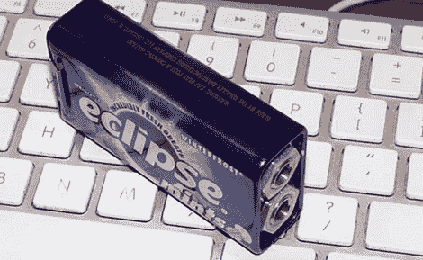

# 制作一个更好的，MIDI 控制的莱斯利踏脚转盘

> 原文：<https://hackaday.com/2013/02/17/making-a-better-midi-controlled-leslie-stompbox/>

早在商用 DSP 出现之前，音乐家们就拥有看起来很酷的设备。其中一种改变风琴、吉他和其他电子乐器声音的设备是 Leslie 扬声器，这是一种带有旋转喇叭的扬声器箱，可以在许多经典唱片中听到美妙温暖的颤音。[奈杰尔]没有原来的莱斯利，但他有一个更便宜，更轻的数字效果，模仿原来的莱斯利声音非常好。然而，唯一的问题是需要一个专有的脚踏开关。没问题，因为一个晶体管、一个电阻和一个薄荷罐就能搞定这个 T1。

[Nigel]的 Leslie 模拟器——一个 [Neo Instruments 呼吸机](http://neo-instruments.de/en/ventilator/ventilator-features)——有一个脚踏开关来控制模拟旋转扬声器的速度。扬声器有三种可能的状态，快速、慢速和刹车，都由 TRS 唱机连接器控制。Neo Instruments 可能是为了在专有脚踏开关上欺骗消费者，决定使用唱机连接器的环和尖端来控制速度。然而，他们这样做的方式使得单个继电器或开关不可能改变速度。

对[Nigel]来说没有问题，因为通过一个非常简单的电路，仅由一个晶体管和一个电阻组成，他可以在 Leslie 模拟器上使用任何他想要的脚踏开关。该版本不支持刹车功能，但他无论如何也不会使用它。不到一美元的零件和一美元五十美分的新罐头还不错。