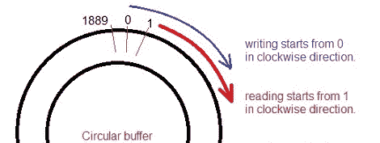

# 用简单的微控制器实现数字延迟

> 原文：<https://hackaday.com/2012/05/25/making-a-digital-delay-from-a-simple-microcontroller/>

如果你想开始尝试 DSP，或者只是想建立一个吉他踏板，这里的项目适合你。这是[一个音频回声](http://blog.vinu.co.in/2012/05/generating-audio-echo-using-atmega32.html)，仅仅使用了来自【Vinod】的富有成果的工作室的微控制器。

在他的电路中，[Vinod]将一个小型驻极体麦克风的输出馈入一个小型放大器，然后馈入 ATMega32 的 ADC。在微控制器内部，[Vinod]设置了一个圆形阵列，它写入来自麦克风的电压，并将其发送到扬声器。因为阵列是圆形的(即，当它到达末端时，它会循环)，所以[Vinod]有一个数字版本的磁带循环，非常适合记录声音和播放回声。

因为[Vinod]使用的是 ATMega32，他只有有限的 RAM 来记录音频样本。使用功能更强的微控制器，甚至增加一个大 RAM 芯片，可以延长延迟时间。通过他的设置，[Vinod]可以用音频和 DSP 做一些真正有趣的实验，所以如果一位有进取心的音乐家将这个项目作为数字延迟踏脚转盘的基础，我们不会感到惊讶。

休息过后，你可以看看[Vinod]的 echo 机器演示。

[https://www.youtube.com/embed/q-qBbiaAhu0?version=3&rel=1&showsearch=0&showinfo=1&iv_load_policy=1&fs=1&hl=en-US&autohide=2&wmode=transparent](https://www.youtube.com/embed/q-qBbiaAhu0?version=3&rel=1&showsearch=0&showinfo=1&iv_load_policy=1&fs=1&hl=en-US&autohide=2&wmode=transparent)