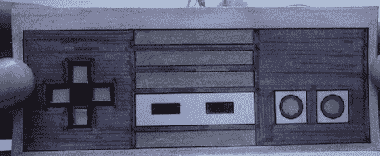

# 用电容触摸制作游戏

> 原文：<https://hackaday.com/2012/08/08/making-a-game-with-capacitive-touch/>

Hackaday 最近已经看到了大量使用 Arduino CapSense 库的构建，所以我们发布能够在屏幕上移动精灵的[电容感应游戏控制器](http://www.treehouseprojects.ca/capsensegame/)只是时间问题。

对于这种构建，控制器是由小铝箔条制成的，用几个电阻直接连接到 Arduino。一旦嵌入一个奇妙的外壳，带来怀旧的痛苦，是时候写游戏了。

对于构建的游戏部分，处理被引入到混合中，以创建一个以海绵宝宝为主题的“捕捉水母场中的所有水母”游戏。通过贴上 d-pad 的触点，玩家可以移动海绵宝宝来捕捉水母。如果你想试试这个游戏，你可以在你的浏览器[的项目页面](http://www.treehouseprojects.ca/capsensegame/)上玩。

这不是我们在 Hackaday 上看到的第一个——也不是最后一个——cap sense 构建，但它*是*第一个致力于 DIY(尽管是受任天堂启发)视频游戏控制器的构建。如果六个按钮不够，你只能等待 PS3 版本。