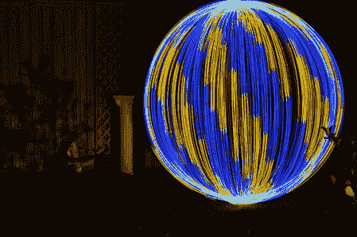

# 做一个光球一样的东西

> 原文：<https://hackaday.com/2012/06/11/making-a-light-orb-thingy/>

“光球”已经成为光画项目的主要部分。如果你曾经看过某人的光画画廊，你可能已经看过一些了。有多种方法可以制作它们，这个项目专注于[摆动一盏灯，或者在你慢慢转圈的时候在一根绳子的末端放多个灯](http://www.flickr.com/photos/txross/7355905098)。

可寻址的 RGB 发光二极管和微控制器的加入使这个装置能够在球体本身中产生图案，甚至可能产生简单的图像。他的成绩令人印象深刻。他的球体实际上看起来比我们在之前与你分享的[自动化球体装备更加精确！](http://hackaday.com/2012/05/01/build-a-rig-to-make-orbs-in-your-light-paintings/)